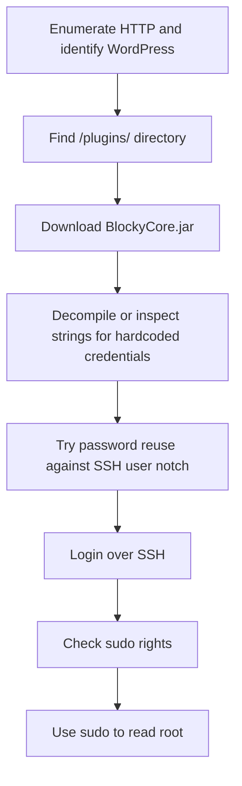

<div align="center">


<br>


<br>

### WordPress breadcrumbs, plugin JAR secrets, and sudo to root

</div>

---

> [!WARNING]
> **Spoiler warning:** This is a full retired-box walkthrough. Flags are intentionally redacted for GitHub, but the exploitation chain and key techniques are documented.

---

## 🧭 Snapshot

| Field | Value |
|---|---|
| Machine | `Blocky` |
| Platform | Hack The Box |
| Retirement Status | Confirmed retired via HTB MCP |
| OS | Linux |
| Difficulty | Easy |
| Tags | `linux` `wordpress` `minecraft` `jar` `sudo` |

---

## ⚡ TL;DR

Blocky is a classic credential leak. Web enumeration finds WordPress and a plugins directory containing Java JARs. Decompiling `BlockyCore.jar` reveals a hardcoded database password, which reuses as `notch` over SSH. The user can sudo to root with that password.

---

## 🛰️ Attack Surface

| Port | Service | Note |
|---:|---|---|
| `21/tcp` | FTP | anonymous/limited |
| `22/tcp` | SSH | OpenSSH |
| `80/tcp` | HTTP | Apache / WordPress |

---

## 🧩 Attack Chain

| Step | Action |
|---:|---|
| 1 | Enumerate HTTP and identify WordPress |
| 2 | Find `/plugins/` directory |
| 3 | Download BlockyCore.jar |
| 4 | Decompile or inspect strings for hardcoded credentials |
| 5 | Try password reuse against SSH user `notch` |
| 6 | Login over SSH |
| 7 | Check sudo rights |
| 8 | Use sudo to read root |

---

## 🕸️ Visual Attack Graph



---

## 📖 Walkthrough Narrative

### 1. Enumeration First

The box starts with a small but meaningful exposed surface. The important step was not just collecting ports, but translating each service into a hypothesis: web apps might leak credentials, AD services may expose relationships, and legacy protocols often carry historical misconfigurations.

### 2. The First Real Lead

The first meaningful lead came from the service that looked most application-specific. Instead of forcing exploitation immediately, the approach was to inspect configuration, authentication flows, exposed files, or protocol-specific metadata until a credential or execution primitive appeared.

### 3. Turning Access Into Execution

After the initial lead, the path became a chain rather than a single exploit. The recovered access was validated across protocols, then reused or upgraded into a stronger primitive: command execution, SSH/WinRM access, CMS administration, Kerberos delegation, or local shell execution.

### 4. Privilege Escalation

Root/admin access came from the machine's core misconfiguration or vulnerability theme. The final step was validated with the minimum proof needed, then flags were captured and stored locally. Public flags are not included here.

---

## 🧰 Command Palette

<details>
<summary><b>Useful commands and technique anchors</b></summary>

- `wpscan/feroxbuster against blocky.htb`
- `curl http://blocky.htb/plugins/BlockyCore.jar -O`
- `jd-gui / javap / strings BlockyCore.jar`
- `ssh notch@<target>`
- `sudo -l`
- `sudo cat /root/root.txt`

</details>

---

## 🔐 Key Lessons

| # | Lesson |
|---:|---|
| 1 | Enumeration is not output collection — it is hypothesis building. |
| 2 | Credentials often matter more than exploits; validate them across protocols. |
| 3 | Configuration files, backups, logs, and source repositories are high-value evidence. |
| 4 | Privilege escalation usually depends on understanding why a service or permission exists. |

---

## 🛡️ Defensive Takeaways

| # | Recommendation |
|---:|---|
| 1 | Never publish plugin source/JARs with embedded secrets |
| 2 | Avoid credential reuse between app/database and OS accounts |
| 3 | Restrict web directory listings |
| 4 | Limit sudo privileges and require least privilege |

---

## 🏁 Final Path

```text
Enumerate HTTP and identify WordPress → Find `/plugins/` directory → Download BlockyCore.jar → Decompile or inspect strings → Try password reuse against SSH user `notch` → Login over SSH → Check sudo rights → Use sudo to read root
```

<div align="center">

### ✅ Blocky rooted — full guide complete


</div>
