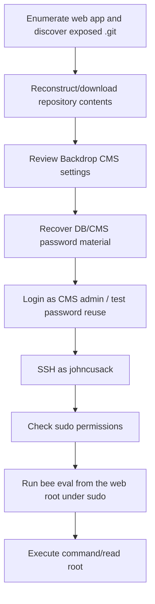

<div align="center">


<br>


<br>

### Exposed Git, Backdrop CMS credentials, and sudo bee eval

</div>

---

> [!WARNING]
> **Spoiler warning:** This is a full retired-box walkthrough. Flags are intentionally redacted for GitHub, but the exploitation chain and key techniques are documented.

---

## 🧭 Snapshot

| Field | Value |
|---|---|
| Machine | `Dog` |
| Platform | Hack The Box |
| Retirement Status | Confirmed retired via HTB MCP |
| OS | Linux |
| Difficulty | Easy |
| Tags | `linux` `git-leak` `backdrop-cms` `credential-reuse` `sudo` |

---

## ⚡ TL;DR

Dog is source-disclosure driven. An exposed `.git` repository leaks Backdrop CMS settings, including database credentials and salts. The recovered password reuses into CMS/SSH. The `johncusack` user can run Backdrop's `bee` utility with sudo, and `bee eval` becomes root command execution.

---

## 🛰️ Attack Surface

| Port | Service | Note |
|---:|---|---|
| `22/tcp` | SSH | OpenSSH |
| `80/tcp` | HTTP | Backdrop CMS |

---

## 🧩 Attack Chain

| Step | Action |
|---:|---|
| 1 | Enumerate web app and discover exposed `.git` |
| 2 | Reconstruct/download repository contents |
| 3 | Review Backdrop CMS settings |
| 4 | Recover DB/CMS password material |
| 5 | Login as CMS admin / test password reuse |
| 6 | SSH as `johncusack` |
| 7 | Check sudo permissions |
| 8 | Run `bee eval` from the web root under sudo |
| 9 | Execute command/read root |

---

## 🕸️ Visual Attack Graph



---

## 📖 Walkthrough Narrative

### 1. Enumeration First

The box starts with a small but meaningful exposed surface. The important step was not just collecting ports, but translating each service into a hypothesis: web apps might leak credentials, AD services may expose relationships, and legacy protocols often carry historical misconfigurations.

### 2. The First Real Lead

The first meaningful lead came from the service that looked most application-specific. Instead of forcing exploitation immediately, the approach was to inspect configuration, authentication flows, exposed files, or protocol-specific metadata until a credential or execution primitive appeared.

### 3. Turning Access Into Execution

After the initial lead, the path became a chain rather than a single exploit. The recovered access was validated across protocols, then reused or upgraded into a stronger primitive: command execution, SSH/WinRM access, CMS administration, Kerberos delegation, or local shell execution.

### 4. Privilege Escalation

Root/admin access came from the machine's core misconfiguration or vulnerability theme. The final step was validated with the minimum proof needed, then flags were captured and stored locally. Public flags are not included here.

---

## 🧰 Command Palette

<details>
<summary><b>Useful commands and technique anchors</b></summary>

- `git-dumper or manual .git reconstruction`
- `grep settings.php for database and hash salt values`
- `Backdrop CMS admin login with recovered password`
- `ssh johncusack@<target>`
- `sudo -l`
- `sudo /usr/local/bin/bee eval 'system(...)'`

</details>

---

## 🔐 Key Lessons

| # | Lesson |
|---:|---|
| 1 | Enumeration is not output collection — it is hypothesis building. |
| 2 | Credentials often matter more than exploits; validate them across protocols. |
| 3 | Configuration files, backups, logs, and source repositories are high-value evidence. |
| 4 | Privilege escalation usually depends on understanding why a service or permission exists. |

---

## 🛡️ Defensive Takeaways

| # | Recommendation |
|---:|---|
| 1 | Never deploy `.git` directories to web roots |
| 2 | Rotate secrets exposed through source repositories |
| 3 | Prevent password reuse between DB/CMS/OS accounts |
| 4 | Avoid sudo permissions on application helper tools with eval capabilities |

---

## 🏁 Final Path

```text
Enumerate web app and discover exposed `.git` → Reconstruct/download repository contents → Review Backdrop CMS settings → Recover DB/CMS password material → Login as CMS admin / test password reuse → SSH as `johncusack` → Check sudo permissions → Run `bee eval` from the web root under sudo → Execute command/read root
```

<div align="center">

### ✅ Dog rooted — full guide complete


</div>
