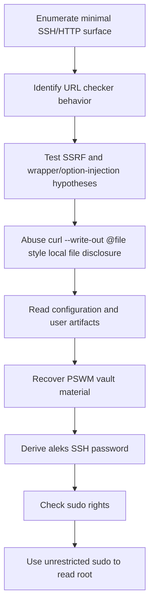

<div align="center">


<br>


<br>

### URL checker abuse, curl option injection, and a password vault mistake

</div>

---

> [!WARNING]
> **Spoiler warning:** This is a full retired-box walkthrough. Flags are intentionally redacted for GitHub, but the exploitation chain and key techniques are documented.

---

## 🧭 Snapshot

| Field | Value |
|---|---|
| Machine | `Down` |
| Platform | Hack The Box |
| Retirement Status | Confirmed retired via HTB MCP |
| OS | Linux |
| Difficulty | Easy |
| Tags | `linux` `web` `ssrf` `file-disclosure` `sudo` |

---

## ⚡ TL;DR

Down hides the solve inside a simple URL-checker app. SSRF testing leads to curl option injection, which enables local file disclosure. A PSWM password vault is recovered and cracked/decrypted, yielding `aleks` credentials; that user has unrestricted sudo.

---

## 🛰️ Attack Surface

| Port | Service | Note |
|---:|---|---|
| `22/tcp` | SSH | OpenSSH 8.9p1 |
| `80/tcp` | HTTP | Apache 2.4.52 / URL checker |

---

## 🧩 Attack Chain

| Step | Action |
|---:|---|
| 1 | Enumerate minimal SSH/HTTP surface |
| 2 | Identify URL checker behavior |
| 3 | Test SSRF and wrapper/option-injection hypotheses |
| 4 | Abuse curl `--write-out @file` style local file disclosure |
| 5 | Read configuration and user artifacts |
| 6 | Recover PSWM vault material |
| 7 | Derive `aleks` SSH password |
| 8 | Check sudo rights |
| 9 | Use unrestricted sudo to read root |

---

## 🕸️ Visual Attack Graph



---

## 📖 Walkthrough Narrative

### 1. Enumeration First

The box starts with a small but meaningful exposed surface. The important step was not just collecting ports, but translating each service into a hypothesis: web apps might leak credentials, AD services may expose relationships, and legacy protocols often carry historical misconfigurations.

### 2. The First Real Lead

The first meaningful lead came from the service that looked most application-specific. Instead of forcing exploitation immediately, the approach was to inspect configuration, authentication flows, exposed files, or protocol-specific metadata until a credential or execution primitive appeared.

### 3. Turning Access Into Execution

After the initial lead, the path became a chain rather than a single exploit. The recovered access was validated across protocols, then reused or upgraded into a stronger primitive: command execution, SSH/WinRM access, CMS administration, Kerberos delegation, or local shell execution.

### 4. Privilege Escalation

Root/admin access came from the machine's core misconfiguration or vulnerability theme. The final step was validated with the minimum proof needed, then flags were captured and stored locally. Public flags are not included here.

---

## 🧰 Command Palette

<details>
<summary><b>Useful commands and technique anchors</b></summary>

- `curl URL checker with internal/file-like payloads`
- `curl option injection / --write-out @/path probes`
- `extract PSWM vault files`
- `ssh aleks@<target>`
- `sudo -l`
- `sudo sh -c 'id; cat /root/root.txt'`

</details>

---

## 🔐 Key Lessons

| # | Lesson |
|---:|---|
| 1 | Enumeration is not output collection — it is hypothesis building. |
| 2 | Credentials often matter more than exploits; validate them across protocols. |
| 3 | Configuration files, backups, logs, and source repositories are high-value evidence. |
| 4 | Privilege escalation usually depends on understanding why a service or permission exists. |

---

## 🛡️ Defensive Takeaways

| # | Recommendation |
|---:|---|
| 1 | Never pass user-controlled URLs directly into shell/curl |
| 2 | Deny curl option injection using `--` and allowlist URL schemes |
| 3 | Do not store vault files and decryption material together |
| 4 | Avoid broad sudo ALL grants for normal users |

---

## 🏁 Final Path

```text
Enumerate minimal SSH/HTTP surface → Identify URL checker behavior → Test SSRF and wrapper/option-injection hypotheses → Abuse curl `--write-out @file` style local file disclosure → Read configuration and user artifacts → Recover PSWM vault material → Derive `aleks` SSH password → Check sudo rights → Use unrestricted sudo to read root
```

<div align="center">

### ✅ Down rooted — full guide complete


</div>
