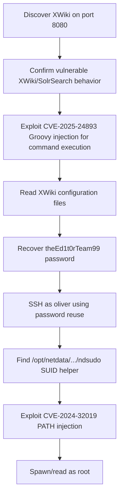

<div align="center">


<br>


<br>

### XWiki Groovy RCE, config credential reuse, and ndsudo PATH injection

</div>

---

> [!WARNING]
> **Spoiler warning:** This is a full retired-box walkthrough. Flags are intentionally redacted for GitHub, but the exploitation chain and key techniques are documented.

---

## 🧭 Snapshot

| Field | Value |
|---|---|
| Machine | `Editor` |
| Platform | Hack The Box |
| Retirement Status | Confirmed retired via HTB MCP |
| OS | Linux |
| Difficulty | Medium |
| Tags | `linux` `xwiki` `cve-2025-24893` `netdata` `cve-2024-32019` |

---

## ⚡ TL;DR

Editor exposes XWiki on Jetty. CVE-2025-24893 leads to Groovy injection/RCE as the XWiki user. Database credentials in `hibernate.cfg.xml` reuse into SSH as `oliver`. Root comes from Netdata's `ndsudo` SUID helper PATH injection (CVE-2024-32019).

---

## 🛰️ Attack Surface

| Port | Service | Note |
|---:|---|---|
| `22/tcp` | SSH | OpenSSH |
| `80/tcp` | HTTP | nginx |
| `8080/tcp` | HTTP | Jetty / XWiki |

---

## 🧩 Attack Chain

| Step | Action |
|---:|---|
| 1 | Discover XWiki on port 8080 |
| 2 | Confirm vulnerable XWiki/SolrSearch behavior |
| 3 | Exploit CVE-2025-24893 Groovy injection for command execution |
| 4 | Read XWiki configuration files |
| 5 | Recover `theEd1t0rTeam99` password |
| 6 | SSH as `oliver` using password reuse |
| 7 | Find `/opt/netdata/.../ndsudo` SUID helper |
| 8 | Exploit CVE-2024-32019 PATH injection |
| 9 | Spawn/read as root |

---

## 🕸️ Visual Attack Graph



---

## 📖 Walkthrough Narrative

### 1. Enumeration First

The box starts with a small but meaningful exposed surface. The important step was not just collecting ports, but translating each service into a hypothesis: web apps might leak credentials, AD services may expose relationships, and legacy protocols often carry historical misconfigurations.

### 2. The First Real Lead

The first meaningful lead came from the service that looked most application-specific. Instead of forcing exploitation immediately, the approach was to inspect configuration, authentication flows, exposed files, or protocol-specific metadata until a credential or execution primitive appeared.

### 3. Turning Access Into Execution

After the initial lead, the path became a chain rather than a single exploit. The recovered access was validated across protocols, then reused or upgraded into a stronger primitive: command execution, SSH/WinRM access, CMS administration, Kerberos delegation, or local shell execution.

### 4. Privilege Escalation

Root/admin access came from the machine's core misconfiguration or vulnerability theme. The final step was validated with the minimum proof needed, then flags were captured and stored locally. Public flags are not included here.

---

## 🧰 Command Palette

<details>
<summary><b>Useful commands and technique anchors</b></summary>

- `curl/browser XWiki enumeration on :8080`
- `CVE-2025-24893 SolrSearch/Groovy payload shape`
- `cat hibernate.cfg.xml`
- `sshpass -p 'theEd1t0rTeam99' ssh oliver@<target>`
- `PATH=/tmp/oliver_path:$PATH ndsudo ...`
- `/tmp/rootshell -p -c 'id; cat /root/root.txt'`

</details>

---

## 🔐 Key Lessons

| # | Lesson |
|---:|---|
| 1 | Enumeration is not output collection — it is hypothesis building. |
| 2 | Credentials often matter more than exploits; validate them across protocols. |
| 3 | Configuration files, backups, logs, and source repositories are high-value evidence. |
| 4 | Privilege escalation usually depends on understanding why a service or permission exists. |

---

## 🛡️ Defensive Takeaways

| # | Recommendation |
|---:|---|
| 1 | Patch XWiki against CVE-2025-24893 |
| 2 | Protect application configuration files and avoid password reuse |
| 3 | Remove unnecessary SUID helpers |
| 4 | Patch Netdata/ndsudo and constrain helper search paths |

---

## 🏁 Final Path

```text
Discover XWiki on port 8080 → Confirm vulnerable XWiki/SolrSearch behavior → Exploit CVE-2025-24893 Groovy injection → Read XWiki configuration files → Recover `theEd1t0rTeam99` password → SSH as `oliver` using password reuse → Find `/opt/netdata/.../ndsudo` SUID helper → Exploit CVE-2024-32019 PATH injection → Spawn/read as root
```

<div align="center">

### ✅ Editor rooted — full guide complete


</div>
