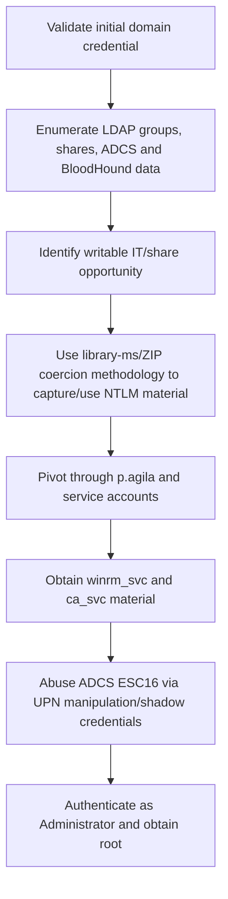

<div align="center">


<br>


<br>

### CVE-assisted NTLM capture, service account pivoting, and ADCS ESC16

</div>

---

> [!WARNING]
> **Spoiler warning:** This is a full retired-box walkthrough. Flags are intentionally redacted for GitHub, but the exploitation chain and key techniques are documented.

---

## 🧭 Snapshot

| Field | Value |
|---|---|
| Machine | `Fluffy` |
| Platform | Hack The Box |
| Retirement Status | Confirmed retired via HTB MCP |
| OS | Windows |
| Difficulty | Easy |
| Tags | `windows` `adcs` `ntlm` `shadow-credentials` `esc16` |

---

## ⚡ TL;DR

Fluffy chains multiple AD techniques. Initial credentials allow domain enumeration and access to a writable share. NTLM coercion and targeted credential work lead to service accounts, then ADCS ESC16/UPN manipulation and shadow-credential-style abuse yield Administrator material.

---

## 🛰️ Attack Surface

| Port | Service | Note |
|---:|---|---|
| `53/88` | DNS/Kerberos | fluffy.htb |
| `389/636` | LDAP/LDAPS | AD metadata |
| `445` | SMB | IT share |
| `5985` | WinRM | lateral access |

---

## 🧩 Attack Chain

| Step | Action |
|---:|---|
| 1 | Validate initial domain credential |
| 2 | Enumerate LDAP groups, shares, ADCS and BloodHound data |
| 3 | Identify writable IT/share opportunity |
| 4 | Use library-ms/ZIP coercion methodology to capture/use NTLM material |
| 5 | Pivot through p.agila and service accounts |
| 6 | Obtain winrm_svc and ca_svc material |
| 7 | Abuse ADCS ESC16 via UPN manipulation/shadow credentials |
| 8 | Authenticate as Administrator and obtain root |

---

## 🕸️ Visual Attack Graph



---

## 📖 Walkthrough Narrative

### 1. Enumeration First

The box starts with a small but meaningful exposed surface. The important step was not just collecting ports, but translating each service into a hypothesis: web apps might leak credentials, AD services may expose relationships, and legacy protocols often carry historical misconfigurations.

### 2. The First Real Lead

The first meaningful lead came from the service that looked most application-specific. Instead of forcing exploitation immediately, the approach was to inspect configuration, authentication flows, exposed files, or protocol-specific metadata until a credential or execution primitive appeared.

### 3. Turning Access Into Execution

After the initial lead, the path became a chain rather than a single exploit. The recovered access was validated across protocols, then reused or upgraded into a stronger primitive: command execution, SSH/WinRM access, CMS administration, Kerberos delegation, or local shell execution.

### 4. Privilege Escalation

Root/admin access came from the machine's core misconfiguration or vulnerability theme. The final step was validated with the minimum proof needed, then flags were captured and stored locally. Public flags are not included here.

---

## 🧰 Command Palette

<details>
<summary><b>Useful commands and technique anchors</b></summary>

- `nxc ldap/smb/winrm against fluffy.htb`
- `certipy-ad find for ADCS templates and CA configuration`
- `BloodHound collection and relationship review`
- `CVE-2025-24071/library-ms coercion workflow`
- `certipy shadow / account update flow around ca_svc`
- `secretsdump/wmiexec with recovered Administrator hash`

</details>

---

## 🔐 Key Lessons

| # | Lesson |
|---:|---|
| 1 | Enumeration is not output collection — it is hypothesis building. |
| 2 | Credentials often matter more than exploits; validate them across protocols. |
| 3 | Configuration files, backups, logs, and source repositories are high-value evidence. |
| 4 | Privilege escalation usually depends on understanding why a service or permission exists. |

---

## 🛡️ Defensive Takeaways

| # | Recommendation |
|---:|---|
| 1 | Restrict write access to shared folders used by privileged users |
| 2 | Patch/mitigate coercion vectors and monitor outbound NTLM |
| 3 | Harden ADCS templates and disable unsafe ESC16 conditions |
| 4 | Monitor UPN changes, shadow credential writes, and certificate-auth anomalies |

---

## 🏁 Final Path

```text
Validate initial domain credential → Enumerate LDAP groups, shares, ADCS and BloodHound data → Identify writable IT/share opportunity → Use library-ms/ZIP coercion methodology to capture/use NTLM material → Pivot through p.agila and service accounts → Obtain winrm_svc and ca_svc material → Abuse ADCS ESC16 → Authenticate as Administrator and obtain root
```

<div align="center">

### ✅ Fluffy rooted — full guide complete


</div>
