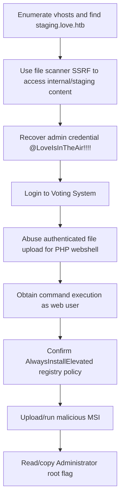

<div align="center">


<br>


<br>

### SSRF to staging secrets, Voting System upload RCE, AlwaysInstallElevated

</div>

---

> [!WARNING]
> **Spoiler warning:** This is a full retired-box walkthrough. Flags are intentionally redacted for GitHub, but the exploitation chain and key techniques are documented.

---

## 🧭 Snapshot

| Field | Value |
|---|---|
| Machine | `Love` |
| Platform | Hack The Box |
| Retirement Status | Confirmed retired via HTB MCP |
| OS | Windows |
| Difficulty | Easy |
| Tags | `windows` `ssrf` `file-upload` `rce` `alwaysinstallelevated` |

---

## ⚡ TL;DR

Love uses a public site plus hidden staging host. SSRF in the file scanner reveals staging content and admin credentials. Authenticated Voting System upload leads to webshell/RCE. Privilege escalation is the classic AlwaysInstallElevated MSI path.

---

## 🛰️ Attack Surface

| Port | Service | Note |
|---:|---|---|
| `80/443` | HTTP/HTTPS | Apache/PHP |
| `5000` | HTTP | staging scanner |
| `445` | SMB | Windows host |
| `3306` | MySQL | MariaDB |

---

## 🧩 Attack Chain

| Step | Action |
|---:|---|
| 1 | Enumerate vhosts and find `staging.love.htb` |
| 2 | Use file scanner SSRF to access internal/staging content |
| 3 | Recover admin credential `@LoveIsInTheAir!!!!` |
| 4 | Login to Voting System |
| 5 | Abuse authenticated file upload for PHP webshell |
| 6 | Obtain command execution as web user |
| 7 | Confirm AlwaysInstallElevated registry policy |
| 8 | Upload/run malicious MSI |
| 9 | Read/copy Administrator root flag |

---

## 🕸️ Visual Attack Graph



---

## 📖 Walkthrough Narrative

### 1. Enumeration First

The box starts with a small but meaningful exposed surface. The important step was not just collecting ports, but translating each service into a hypothesis: web apps might leak credentials, AD services may expose relationships, and legacy protocols often carry historical misconfigurations.

### 2. The First Real Lead

The first meaningful lead came from the service that looked most application-specific. Instead of forcing exploitation immediately, the approach was to inspect configuration, authentication flows, exposed files, or protocol-specific metadata until a credential or execution primitive appeared.

### 3. Turning Access Into Execution

After the initial lead, the path became a chain rather than a single exploit. The recovered access was validated across protocols, then reused or upgraded into a stronger primitive: command execution, SSH/WinRM access, CMS administration, Kerberos delegation, or local shell execution.

### 4. Privilege Escalation

Root/admin access came from the machine's core misconfiguration or vulnerability theme. The final step was validated with the minimum proof needed, then flags were captured and stored locally. Public flags are not included here.

---

## 🧰 Command Palette

<details>
<summary><b>Useful commands and technique anchors</b></summary>

- `ffuf vhost discovery for love.htb`
- `curl scanner SSRF against staging/local URLs`
- `searchsploit Voting System upload RCE`
- `upload PHP webshell via authenticated admin panel`
- `reg query HKCU/HKLM AlwaysInstallElevated`
- `msfvenom -f msi windows/exec CMD=...`
- `msiexec /quiet /qn /i C:\ProgramData\payload.msi`

</details>

---

## 🔐 Key Lessons

| # | Lesson |
|---:|---|
| 1 | Enumeration is not output collection — it is hypothesis building. |
| 2 | Credentials often matter more than exploits; validate them across protocols. |
| 3 | Configuration files, backups, logs, and source repositories are high-value evidence. |
| 4 | Privilege escalation usually depends on understanding why a service or permission exists. |

---

## 🛡️ Defensive Takeaways

| # | Recommendation |
|---:|---|
| 1 | Prevent SSRF with strict URL allowlists and egress controls |
| 2 | Validate uploaded file content server-side |
| 3 | Keep third-party PHP apps patched |
| 4 | Disable AlwaysInstallElevated and monitor MSI installs |

---

## 🏁 Final Path

```text
Enumerate vhosts and find `staging.love.htb` → Use file scanner SSRF to access internal/staging content → Recover admin credential `@LoveIsInTheAir!!!!` → Login to Voting System → Abuse authenticated file upload → Obtain command execution as web user → Confirm AlwaysInstallElevated registry policy → Upload/run malicious MSI → Read/copy Administrator root flag
```

<div align="center">

### ✅ Love rooted — full guide complete


</div>
