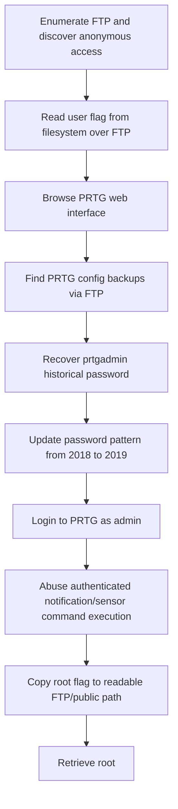

<div align="center">


<br>


<br>

### Anonymous FTP, PRTG credential history, and authenticated sensor RCE

</div>

---

> [!WARNING]
> **Spoiler warning:** This is a full retired-box walkthrough. Flags are intentionally redacted for GitHub, but the exploitation chain and key techniques are documented.

---

## 🧭 Snapshot

| Field | Value |
|---|---|
| Machine | `Netmon` |
| Platform | Hack The Box |
| Retirement Status | Confirmed retired via HTB MCP |
| OS | Windows |
| Difficulty | Easy |
| Tags | `windows` `ftp` `prtg` `cve-2018-9276` `rce` |

---

## ⚡ TL;DR

Netmon exposes the filesystem over anonymous FTP and PRTG on HTTP. The user flag is readable via FTP. PRTG configuration backups reveal old credentials; incrementing the year gives valid admin access. Authenticated PRTG sensor/notification abuse (CVE-2018-9276 style) copies/executes commands to retrieve root.

---

## 🛰️ Attack Surface

| Port | Service | Note |
|---:|---|---|
| `21/tcp` | FTP | anonymous file access |
| `80/tcp` | HTTP | PRTG Network Monitor |
| `445` | SMB | Windows services |
| `5985` | WinRM | management |

---

## 🧩 Attack Chain

| Step | Action |
|---:|---|
| 1 | Enumerate FTP and discover anonymous access |
| 2 | Read user flag from filesystem over FTP |
| 3 | Browse PRTG web interface |
| 4 | Find PRTG config backups via FTP |
| 5 | Recover `prtgadmin` historical password |
| 6 | Update password pattern from 2018 to 2019 |
| 7 | Login to PRTG as admin |
| 8 | Abuse authenticated notification/sensor command execution |
| 9 | Copy root flag to readable FTP/public path |
| 10 | Retrieve root |

---

## 🕸️ Visual Attack Graph



---

## 📖 Walkthrough Narrative

### 1. Enumeration First

The box starts with a small but meaningful exposed surface. The important step was not just collecting ports, but translating each service into a hypothesis: web apps might leak credentials, AD services may expose relationships, and legacy protocols often carry historical misconfigurations.

### 2. The First Real Lead

The first meaningful lead came from the service that looked most application-specific. Instead of forcing exploitation immediately, the approach was to inspect configuration, authentication flows, exposed files, or protocol-specific metadata until a credential or execution primitive appeared.

### 3. Turning Access Into Execution

After the initial lead, the path became a chain rather than a single exploit. The recovered access was validated across protocols, then reused or upgraded into a stronger primitive: command execution, SSH/WinRM access, CMS administration, Kerberos delegation, or local shell execution.

### 4. Privilege Escalation

Root/admin access came from the machine's core misconfiguration or vulnerability theme. The final step was validated with the minimum proof needed, then flags were captured and stored locally. Public flags are not included here.

---

## 🧰 Command Palette

<details>
<summary><b>Useful commands and technique anchors</b></summary>

- `ftp anonymous@<target>`
- `curl ftp://<target>/Users/Public/user.txt`
- `download ProgramData/Paessler/PRTG config backups`
- `grep prtgadmin credentials`
- `login PRTG with PrTg@dmin2019`
- `CVE-2018-9276 authenticated command payload`
- `curl ftp://<target>/Users/Public/root.txt`

</details>

---

## 🔐 Key Lessons

| # | Lesson |
|---:|---|
| 1 | Enumeration is not output collection — it is hypothesis building. |
| 2 | Credentials often matter more than exploits; validate them across protocols. |
| 3 | Configuration files, backups, logs, and source repositories are high-value evidence. |
| 4 | Privilege escalation usually depends on understanding why a service or permission exists. |

---

## 🛡️ Defensive Takeaways

| # | Recommendation |
|---:|---|
| 1 | Disable anonymous FTP and restrict filesystem exposure |
| 2 | Do not store reversible/plain credentials in backup configs |
| 3 | Patch PRTG and restrict admin access |
| 4 | Monitor PRTG notification/sensor command execution |

---

## 🏁 Final Path

```text
Enumerate FTP and discover anonymous access → Read user flag from filesystem over FTP → Browse PRTG web interface → Find PRTG config backups → Recover `prtgadmin` historical password → Update password pattern from 2018 to 2019 → Login to PRTG as admin → Abuse authenticated notification/sensor command execution → Copy root flag to readable FTP/public path → Retrieve root
```

<div align="center">

### ✅ Netmon rooted — full guide complete


</div>
