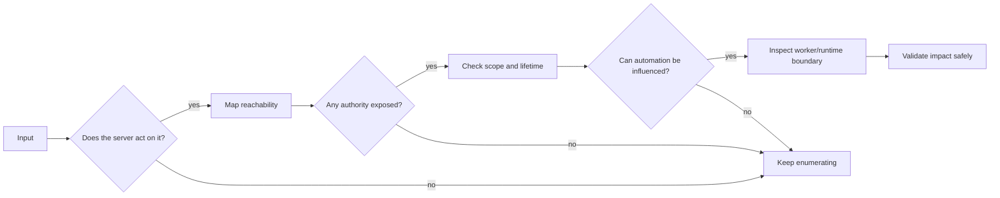

<h1 align="center">☁️ Nimbus — A No-Spoiler Cloud-Noir Field Journal</h1>

<p align="center">
  
  
  
</p>

> **Spoiler posture:** this is a mood-and-method writeup. No flags, no exact exploit recipe, no copy-paste payload chain.  
> **Core message:** Nimbus is not about one clever trick. It is about noticing where one component quietly trusts the next.

---

## 🧭 Executive Vibe Check

Nimbus feels like walking into a clean lobby and slowly realizing the real building is behind the walls: a front-end workflow, internal-only reachability, short-lived access, asynchronous processing, and runtime boundaries that deserve skepticism.

The box is strongest when treated less like a checklist and more like an investigation:

```text
user-controlled behavior
        ↓
server-side reachability
        ↓
temporary authority
        ↓
background automation
        ↓
container trust boundary
        ↓
host-level consequence
```

The important question is rarely **“what payload works?”**  
It is usually **“what does this component get to touch that I do not?”**

---

## 🗺️ Spoiler-Free Trust Map

<p align="center">
  
</p>

Think of Nimbus as a chain of small permissions. Each permission seems reasonable alone. The fun starts when they line up.

---

## 🎬 The Story Beats

### Act I — The Polite Web App

At first, Nimbus wears the shape of a normal web application. There is enough surface to make you enumerate carefully, but not enough to reward random button-smashing. The first lesson is restraint: observe behaviors, compare responses, and map what the app appears to do on your behalf.

### Act II — Reachability Becomes Power

The moment a server performs network-aware work for a user, the threat model changes. The web tier may see routes, services, metadata, or internal APIs that are invisible from the outside. Nimbus makes that distinction matter.

### Act III — Temporary Does Not Mean Toothless

Ephemeral credentials are easy to underestimate. They expire, yes — but while valid, they can still express whatever permissions were attached to them. Nimbus uses that tension well: limited time, meaningful trust.

### Act IV — The Queue Has Teeth

Queues are often described as plumbing. Security-wise, plumbing can flood the house. If a worker accepts messages, performs privileged actions, or assumes producers are honest, the queue becomes a boundary worth testing.

### Act V — The Container Question

Containers are packaging, isolation, and convenience — but not magic. Runtime configuration decides whether the boundary is a wall, a fence, or a painted line on the floor.

---

## 🔎 What I Would Pay Attention To

| Area | Spoiler-free question to ask |
|---|---|
| Web behavior | What does the server fetch, render, transform, enqueue, or process for me? |
| Network position | What can the application reach from *inside* that I cannot reach from outside? |
| Credentials | Are short-lived permissions scoped tightly enough for their purpose? |
| Queues | Who can produce messages, and how does the worker validate intent? |
| Containers | Are mounts, privileges, sockets, and runtime capabilities constrained? |
| Automation | What background jobs run without a human watching each step? |

---

## 🧠 Lessons That Transfer To Real Assessments

### 1. SSRF impact is environmental

An SSRF primitive is not automatically critical or harmless. Its impact depends on routing, egress rules, cloud metadata exposure, internal service trust, and what responses leak back.

### 2. Least privilege matters most when credentials are automatic

Machine identities, instance roles, and task credentials are operationally convenient. They also become attacker-friendly when attached to broad permissions.

### 3. Message queues deserve threat models

Treat queue producers and consumers like an API contract, not a private hallway. Validate schema, authorization, source identity, and dangerous fields.

### 4. Container hardening is not optional decoration

Useful checks include privileged mode, mounted host paths, Docker/container sockets, Linux capabilities, writable sensitive paths, and kernel-facing interfaces.

### 5. The relationship graph is the vulnerability

Nimbus is memorable because the weakness lives between components. Modern systems often fail at the seams.

---

## 🛡️ Defender’s Checklist

- [ ] Enforce strict URL allowlists and block internal/private ranges at the network layer.
- [ ] Protect metadata services; require modern metadata protections where available.
- [ ] Scope temporary credentials to the smallest action set and resource set possible.
- [ ] Add queue-level auth, producer authorization, message signing, and schema validation.
- [ ] Run workers with minimal IAM/cloud privileges.
- [ ] Avoid privileged containers and dangerous host mounts unless absolutely necessary.
- [ ] Monitor unusual queue messages, worker job definitions, build events, and runtime changes.
- [ ] Treat internal APIs as authenticated security boundaries, not trusted-by-location utilities.

---

## ✨ A Tiny Mental Model



---

## 🏁 Final Reflection

Nimbus is a great reminder that cloud-flavored exploitation is often quiet. No single piece needs to look outrageous. The web app does web-app things. The credentials are temporary. The queue is just a queue. The worker is just automation. The container is just a container.

But when each layer grants the next one a little too much trust, the system starts writing its own attack path.

That is the charm of Nimbus: **the puzzle is not the door — it is the hallway.**

---

## 🏷️ Tags

`#HackTheBox` `#HTB` `#Nimbus` `#NoSpoilers` `#CloudSecurity` `#ContainerSecurity` `#WebSecurity` `#SSRF` `#DevSecOps` `#ThreatModeling` `#RedTeam` `#BlueTeam`

---

<p align="center"><sub>Inspired by the linked no-spoiler Nimbus notes, rewritten as a more visual and creative Markdown field journal.</sub></p>
