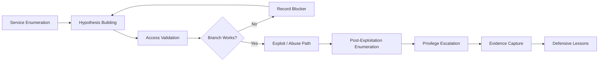

<div align="center">


<br>

[](https://www.hackthebox.com/)


<br>

### 🧠 A curated collection of Hack The Box machine notes, walkthroughs, and post-solve reflections.

<sub>Built for learning, documentation practice, and methodology refinement — not for copy/paste flag hunting.</sub>

</div>

---

> [!IMPORTANT]
> **Spoiler policy:** Full walkthroughs are only published after machines retire. Active-box posts are kept spoiler-light: no flags, passwords, hashes, exact object names, target IPs, or complete exploit chains.

---

## 🗺️ Repository Map

<table>
<tr>
<td width="50%" valign="top">

### 🧾 Writeups

| Machine | Type | Theme | Status |
|---|---|---|---|
| [`Logging`](./Logging-HTB.md) | Full / GitHub-safe | ADCS, gMSA, WSUS spoofing | ✅ Published |
| [`Checkpoint`](./Checkpoint_HTB_NoSpoilers.md) | No-spoiler reflection | AD, evidence handling, branch control | ✅ Published |
| [`Reactor`](./Reactor.md) | Clean-room methodology | Next.js RCE, SQLite, Node Inspector | ✅ Published |
| [`Snapped`](./Snapped_HTB_Writeup.html) | Creative HTML report | Visual report format | ✅ Published |

</td>
<td width="50%" valign="top">

### 🧰 Methodology Themes

| Area | Practiced In |
|---|---|
| Active Directory enumeration | Logging, Checkpoint |
| ADCS review | Logging |
| WSUS abuse concepts | Logging |
| Web application RCE | Reactor |
| Local privilege escalation | Reactor, Logging |
| Evidence-driven analysis | Checkpoint |
| Clean technical writing | All |

</td>
</tr>
</table>

---

## 🧭 What This Repo Is

This repository is my public Hack The Box knowledge base. Each writeup is meant to capture more than just the final exploit path. I try to document:

- how I approached enumeration,
- what evidence mattered,
- what branches failed,
- why the final chain worked,
- what defenders could learn from the box,
- and what I would do differently next time.

<div align="center">

```text
Recon → Hypothesis → Validation → Pivot → Exploit → PrivEsc → Lessons
```

</div>

---

## 🔥 Featured Writeups

<table>
<tr>
<td width="33%" valign="top">

<h3 align="center">🪵 Logging</h3>

<div align="center">


</div>

A Windows AD chain involving readable logs, gMSA credential recovery, AD-integrated DNS, certificate trust, and WSUS update abuse.

**Core lesson:** operational logs and trust infrastructure can combine into a domain compromise path.

➡️ [`Read Logging`](./Logging-HTB.md)

</td>
<td width="33%" valign="top">

<h3 align="center">🛡️ Checkpoint</h3>

<div align="center">


</div>

A spoiler-safe Active Directory reflection focused on permission validation, artifact triage, Kerberos/tooling edge cases, and avoiding tunnel vision.

**Core lesson:** branch control matters as much as exploitation.

➡️ [`Read Checkpoint`](./Checkpoint_HTB_NoSpoilers.md)

</td>
<td width="33%" valign="top">

<h3 align="center">⚛️ Reactor</h3>

<div align="center">


</div>

A clean-room writeup for a Linux web box: framework fingerprinting, pre-auth RCE methodology, local DB discovery, and Node Inspector privilege escalation.

**Core lesson:** localhost debug services are not security boundaries.

➡️ [`Read Reactor`](./Reactor.md)

</td>
</tr>
</table>

---

## 🧩 Writeup Style Guide

I use different formats depending on the box and disclosure posture:

| Format | When I Use It | Includes |
|---|---|---|
| **Full Walkthrough** | Retired boxes with no active-spoiler concern | Detailed path, commands, reasoning, defenses |
| **No-Spoiler Reflection** | Active/recent boxes or public-safe notes | Themes, lessons, high-level flow |
| **Clean-Room Methodology** | Technique-focused posts | Concepts and decision points without free-win payloads |
| **Creative Report** | Portfolio-style reports | HTML/visual storytelling, charts, narrative sections |

> [!TIP]
> My goal is to make every writeup useful even if you are not solving the exact same machine.

---

## 🕸️ Methodology Graph



---

## 🧠 Skills Practiced Across the Repo

<div align="center">

| Category | Examples |
|---|---|
| 🛰️ Recon | Nmap, HTTP fingerprinting, service/version triage |
| 🪪 Auth Testing | SMB/LDAP/WinRM/SSH validation |
| 🏛️ Active Directory | Users, groups, ACLs, BloodHound-style reasoning |
| 📜 ADCS | Template review, EKUs, enrollment rights |
| 📁 Evidence Handling | Logs, shares, SQLite DBs, offline artifacts |
| 🧪 Exploit Validation | CVE research, patch-level matching, safe proofing |
| 🧬 PrivEsc | gMSA, debug interfaces, scheduled/update workflows |
| 🛡️ Defense | Remediation notes and detection-minded takeaways |

</div>

---

## 🧰 Toolkit Highlight

These are common tools and categories that show up throughout the notes:

```text
nmap        netexec / nxc     ldapsearch      smbclient
certipy-ad  bloodyAD          impacket        BloodHound
ffuf        curl/httpx        hashcat         sqlite3
linpeas     winpeas           PowerShell      Python
```

---

## 🔐 Disclosure & Ethics

- I follow Hack The Box rules and avoid posting active-box spoilers.
- Flags are never included in public-safe posts.
- Credentials/hashes may be redacted or omitted depending on the box status.
- The purpose of this repo is education, documentation, and defensive learning.
- Do not use these techniques outside systems you own or are explicitly authorized to test.

---

## 📊 Current Coverage

<div align="center">

| OS | Count | Notes |
|---|---:|---|
| Windows / AD | 2+ | Logging, Checkpoint |
| Linux / Web | 1+ | Reactor |
| Creative HTML Reports | 1+ | Snapped |

<br>


</div>

---

## 📝 Suggested Reading Order

1. **Start with [`Checkpoint`](./Checkpoint_HTB_NoSpoilers.md)** if you want a spoiler-safe AD mindset piece.
2. **Read [`Reactor`](./Reactor.md)** if you like web-to-root methodology and clean-room explanations.
3. **Read [`Logging`](./Logging-HTB.md)** if you want a deeper AD chain involving logs, gMSA, ADCS, DNS, and WSUS.
4. **Open [`Snapped`](./Snapped_HTB_Writeup.html)** if you want a more visual report-style format.

---

## 🚀 Roadmap

- [ ] Add difficulty badges for each machine
- [ ] Add tags at the top of every writeup
- [ ] Add a machine index grouped by OS and technique
- [ ] Add defensive detection notes to each retired-box walkthrough
- [ ] Add screenshots/diagrams where GitHub-safe
- [ ] Convert selected writeups into portfolio-style HTML reports

---

## 🤝 Connect / Feedback

If you spot an error, have a cleaner way to explain a technique, or want to compare approaches, feel free to open an issue or reach out.

<div align="center">

### ⭐ If this repo helps you learn, consider starring it.

<br>


</div>
