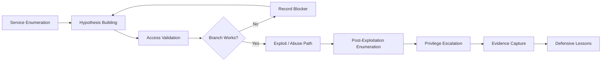

<div align="center">


<br>

[](https://www.hackthebox.com/)


<br>

### 🧠 Hack The Box writeups, clean-room reflections, and creative methodology guides.

<sub>Built for learning, documentation practice, methodology refinement, and defender-minded takeaways.</sub>

</div>

---

> [!IMPORTANT]
> **Spoiler policy:** Full walkthroughs are only published after machines retire. Active-box content is kept spoiler-light: no flags, passwords, hashes, exact object names, target IPs, or complete exploit chains.

---

# 🗺️ Repository Map

## 🧾 Writeups

> Difficulty badges reflect the rating stated in the corresponding local guide. **Unrated** means the guide does not state a rating; it is not an estimate.

| # | Machine | File | Type | Difficulty | Main Theme | Status |
|---:|---|---|---|---|---|---|
| 1 | **Blocky** | [`Blocky-HTB.md`](./Blocky-HTB.md) | Full creative guide |  | WordPress, plugin JAR secrets, sudo | ✅ Retired / Published |
| 2 | **Dog** | [`Dog-HTB.md`](./Dog-HTB.md) | Full creative guide |  | Exposed Git, Backdrop CMS, sudo `bee eval` | ✅ Retired / Published |
| 3 | **Down** | [`Down-HTB.md`](./Down-HTB.md) | Full creative guide |  | SSRF, curl option injection, vault disclosure, sudo | ✅ Retired / Published |
| 4 | **Editor** | [`Editor-HTB.md`](./Editor-HTB.md) | Full creative guide |  | XWiki RCE, config creds, Netdata `ndsudo` privesc | ✅ Retired / Published |
| 5 | **Fluffy** | [`Fluffy-HTB.md`](./Fluffy-HTB.md) | Full creative guide |  | ADCS, NTLM coercion, ESC16, shadow credentials | ✅ Retired / Published |
| 6 | **Lame** | [`Lame-HTB.md`](./Lame-HTB.md) | Full creative guide |  | Legacy Samba usermap script RCE | ✅ Retired / Published |
| 7 | **Love** | [`Love-HTB.md`](./Love-HTB.md) | Full creative guide |  | SSRF, Voting System upload RCE, AlwaysInstallElevated | ✅ Retired / Published |
| 8 | **Netmon** | [`Netmon-HTB.md`](./Netmon-HTB.md) | Full creative guide |  | Anonymous FTP, PRTG credentials, authenticated RCE | ✅ Retired / Published |
| 9 | **Support** | [`Support-HTB.md`](./Support-HTB.md) | Full creative guide |  | AD enumeration, LDAP secrets, RBCD to Administrator | ✅ Retired / Published |
| 10 | **TwoMillion** | [`TwoMillion-HTB.md`](./TwoMillion-HTB.md) | Full creative guide |  | API abuse, command injection, OverlayFS CVE-2023-0386 | ✅ Retired / Published |
| 11 | **Checkpoint** | [`Checkpoint_HTB_NoSpoilers.md`](./Checkpoint_HTB_NoSpoilers.md) | No-spoiler reflection |  | AD, evidence handling, branch control | ⚠️ Active-safe only |
| 12 | **Logging** | [`Logging-HTB.md`](./Logging-HTB.md) | GitHub-safe / active-box style |  | ADCS, gMSA, WSUS spoofing | ⚠️ Active-safe only |
| 13 | **Reactor** | [`Reactor.md`](./Reactor.md) | Clean-room methodology |  | Next.js RCE, SQLite, Node Inspector | ⚠️ Active-safe only |
| 14 | **Snapped** | [`Snapped_HTB_Writeup.html`](./Snapped_HTB_Writeup.html) | Creative HTML report |  | Nginx UI, backup recovery, TOCTOU | ✅ Published |
| 15 | **Orion** | [`Orion.md`](./Orion.md) | Full creative guide |  | Craft CMS RCE, CVE-2025-32432, telnetd injection | ✅ Retired / Published |
| 16 | **Enigma** | [`Engma.md`](./Engma.md) | Spoiler-light field guide |  | Enumeration, web, local recon | ⚠️ Spoiler-safe |
| 17 | **Fireflow** | [`Fireflow.md`](./Fireflow.md) | Full walkthrough |  | Langflow RCE, JWT, Kubernetes | ✅ Published |
| 18 | **Ghostlink** | [`Ghostlink.md`](./Ghostlink.md) | Detailed guide |  | MQTT, NTLM relay, ADCS | ✅ Published |
| 19 | **MakeSense** | [`MakeSense.md`](./MakeSense.md) | Spoiler-free field notes |  | Web enumeration, hypothesis testing | ⚠️ Active-safe only |
| 20 | **Nexus** | [`Nexus.md`](./Nexus.md) | Full walkthrough |  | Krayin CRM, Gitea, path traversal | ✅ Published |
| 21 | **Nimbus** | [`Nimbus-HTB-No-Spoiler.md`](./Nimbus-HTB-No-Spoiler.md) | No-spoiler field journal |  | Web, cloud, queues, containers | ⚠️ Spoiler-safe |
| 22 | **Paperwork** | [`Paperwork.md`](./Paperwork.md) | Narrative walkthrough |  | Printer services, local daemons, root pivot | ✅ Published |
| 23 | **Slonik** | [`Slonik.md`](./Slonik.md) | Technical guide |  | NFS, PostgreSQL, backup automation | ✅ Published |
| 24 | **Sweep** | [`Sweep.md`](./Sweep.md) | GitHub-friendly walkthrough |  | Lansweeper, credential capture, ACL abuse | ✅ Published |

---

## 🗂️ Machine Index

### By OS / platform

| Platform | Machines | Primary techniques |
|---|---|---|
| Linux | Blocky, Dog, Down, Editor, Lame, TwoMillion, Orion, Reactor, Fireflow, Nexus, Paperwork, Slonik, Snapped | Web RCE, credential reuse, sudo/SUID, kernels, containers, local services |
| Windows / Active Directory | Fluffy, Love, Netmon, Support, Checkpoint, Logging, Ghostlink, Sweep | ADCS, Kerberos/RBCD, NTLM, SSRF, upload RCE, service abuse, ACLs |
| Unspecified / spoiler-safe | Enigma, MakeSense, Nimbus | Enumeration, trust boundaries, web workflows, cloud/container methodology |

### By technique

| Technique | Machines |
|---|---|
| Web application RCE | Editor, Love, TwoMillion, Orion, Reactor, Fireflow, Nexus |
| Source, config, or backup disclosure | Blocky, Dog, Down, Editor, Netmon, Orion, Snapped |
| Active Directory / certificate services | Support, Fluffy, Logging, Checkpoint, Ghostlink, Sweep |
| SSRF / server-side reachability | Down, Love, Nimbus |
| Credentials and password reuse | Blocky, Dog, Down, Editor, Netmon, Orion, Reactor, Snapped |
| Linux privilege escalation | Blocky, Dog, Down, Editor, TwoMillion, Orion, Reactor, Fireflow, Nexus, Paperwork, Slonik, Snapped |
| Windows privilege escalation | Love, Netmon, Support, Fluffy, Logging, Ghostlink, Sweep |
| Containers / cloud / automation | Fireflow, Nimbus, Slonik |

---

## 🧰 Methodology Themes

| Area | Practiced In |
|---|---|
| Active Directory enumeration | Support, Fluffy, Logging, Checkpoint |
| RBCD / Kerberos abuse | Support |
| ADCS / certificate abuse | Fluffy, Logging |
| Web application RCE | Editor, Love, Reactor, Orion |
| Source/config disclosure | Dog, Blocky, Editor |
| SSRF / file disclosure | Down, Love |
| Legacy service exploitation | Lame, Netmon, Orion |
| Linux privilege escalation | TwoMillion, Down, Editor, Dog, Blocky, Lame, Orion |
| Windows privilege escalation | Love, Support, Fluffy, Netmon |
| Evidence-driven analysis | Checkpoint, Netmon, Dog |
| PHP object injection / deserialization | Orion |
| CVE chaining (web + service) | Orion |
| Creative report writing | Snapped, all creative guides |

---

# 🧭 What This Repo Is

This repository is my public Hack The Box knowledge base. Each writeup is meant to capture more than just the final exploit path. I try to document:

- how I approached enumeration,
- what evidence mattered,
- what branches failed,
- why the final chain worked,
- what defenders could learn from the box,
- and what I would do differently next time.

<div align="center">

```text
Recon → Hypothesis → Validation → Pivot → Exploit → PrivEsc → Lessons
```

</div>

---

# 🔥 Featured Writeups

<table>
<tr>
<td width="33%" valign="top">

<h3 align="center">🧾 Support</h3>

<div align="center">


</div>

A clean AD chain from anonymous share exposure to LDAP secrets, BloodHound-style relationship analysis, and RBCD-based Administrator impersonation.

**Core lesson:** one dangerous ACL edge on a DC computer object can become full domain compromise.

➡️ [`Read Support`](./Support-HTB.md)

</td>
<td width="33%" valign="top">

<h3 align="center">🧪 Editor</h3>

<div align="center">


</div>

A web-to-root Linux chain involving XWiki Groovy injection, configuration credential reuse, and Netdata `ndsudo` PATH injection.

**Core lesson:** application config secrets and helper binaries often complete the path after RCE.

➡️ [`Read Editor`](./Editor-HTB.md)

</td>
<td width="33%" valign="top">

<h3 align="center">🐶 Dog</h3>

<div align="center">


</div>

A source-disclosure-driven solve: exposed Git leaks Backdrop CMS secrets, credentials reuse into SSH, and sudo `bee eval` becomes root command execution.

**Core lesson:** exposed source control can reveal the whole operational trust chain.

➡️ [`Read Dog`](./Dog-HTB.md)

</td>
</tr>
</table>

---

# 🧩 Writeup Style Guide

| Format | When I Use It | Includes |
|---|---|---|
| **Full Creative Guide** | Retired boxes with local root completion | Detailed chain, visual map, commands, lessons, defenses |
| **No-Spoiler Reflection** | Active/recent boxes or public-safe notes | Themes, lessons, high-level flow |
| **Clean-Room Methodology** | Technique-focused posts | Concepts and decision points without free-win payloads |
| **Creative Report** | Portfolio-style reports | HTML/visual storytelling, charts, narrative sections |

> [!TIP]
> My goal is to make every writeup useful even if you are not solving the exact same machine.

---

# 🕸️ Methodology Graph



---

# 🧠 Skills Practiced Across the Repo

<div align="center">

| Category | Examples |
|---|---|
| 🛰️ Recon | Nmap, HTTP fingerprinting, service/version triage |
| 🪪 Auth Testing | SMB/LDAP/WinRM/SSH validation |
| 🏛️ Active Directory | Users, groups, ACLs, BloodHound-style reasoning |
| 📜 ADCS | Template review, EKUs, enrollment rights |
| 📁 Evidence Handling | Logs, shares, SQLite DBs, offline artifacts, source repos |
| 🧪 Exploit Validation | CVE research, patch-level matching, safe proofing |
| 🧬 PrivEsc | gMSA, debug interfaces, scheduled/update workflows, sudo/SUID |
| 🛡️ Defense | Remediation notes and detection-minded takeaways |

</div>

---

# 🧰 Toolkit Highlight

```text
nmap        netexec / nxc     ldapsearch      smbclient
certipy-ad  bloodyAD          impacket        BloodHound
ffuf        feroxbuster       curl/httpx      hashcat
git-dumper  wpscan           sshpass         sqlite3
linpeas     winpeas           msfvenom        Python
PowerShell  certipy           responder       ntlmrelayx
```

---

# 🔐 Disclosure & Ethics

- I follow Hack The Box rules and avoid posting active-box spoilers.
- Flags are never included in public-safe posts.
- Credentials/hashes may be redacted or omitted depending on the box status.
- The purpose of this repo is education, documentation, and defensive learning.
- Do not use these techniques outside systems you own or are explicitly authorized to test.

---

# 📊 Current Coverage

<div align="center">

| OS / Category | Count | Examples |
|---|---:|---|
| Windows / AD | 6 | Support, Fluffy, Logging, Checkpoint, Ghostlink, Sweep |
| Windows / Web + PrivEsc | 2 | Love, Netmon |
| Linux / Web + PrivEsc | 13 | TwoMillion, Down, Editor, Dog, Blocky, Reactor, Lame, Orion, Fireflow, Nexus, Paperwork, Slonik, Snapped |
| Full Creative Markdown Guides | 11 | TwoMillion, Support, Fluffy, Down, Editor, Dog, Love, Netmon, Blocky, Lame, Orion |
| Active-safe / No-spoiler Posts | 6 | Logging, Checkpoint, Reactor, Enigma, MakeSense, Nimbus |
| Creative HTML Reports | 1 | Snapped |

<br>


</div>

---

# 📝 Suggested Reading Order

1. **Classic fundamentals:** [`Lame`](./Lame-HTB.md) → [`Blocky`](./Blocky-HTB.md)
2. **Linux web-to-root:** [`TwoMillion`](./TwoMillion-HTB.md) → [`Down`](./Down-HTB.md) → [`Editor`](./Editor-HTB.md) → [`Orion`](./Orion.md)
3. **Source/config disclosure:** [`Dog`](./Dog-HTB.md)
4. **Windows web/privesc:** [`Love`](./Love-HTB.md) → [`Netmon`](./Netmon-HTB.md)
5. **Active Directory chains:** [`Support`](./Support-HTB.md) → [`Fluffy`](./Fluffy-HTB.md)
6. **Spoiler-safe mindset posts:** [`Checkpoint`](./Checkpoint_HTB_NoSpoilers.md) → [`Reactor`](./Reactor.md) → [`Logging`](./Logging-HTB.md)
7. **Visual report style:** [`Snapped`](./Snapped_HTB_Writeup.html)

---

# 🚀 Roadmap

- [x] Add full creative guides for first 10 retired/rooted boxes
- [x] Add all writeups to the README writeups section
- [x] Add difficulty badges for every machine row
- [x] Add tags at the top of every guide
- [x] Add a machine index grouped by OS and technique
- [x] Add defensive detection notes to each retired-box walkthrough
- [ ] Add screenshots/diagrams where GitHub-safe
- [ ] Convert selected writeups into portfolio-style HTML reports

---

# 🤝 Connect / Feedback

If you spot an error, have a cleaner way to explain a technique, or want to compare approaches, feel free to open an issue or reach out.

<div align="center">

### ⭐ If this repo helps you learn, consider starring it.

<br>


</div>
